# 第二步：NFA构造 (从正则表达式构造NFA)

## 概述

本节介绍如何从正则表达式构造等价的不确定有限自动机(NFA)。对于字母表Σ上的任意正则表达式R，都存在一个NFA M，使得L(M) = L(R)，反之亦然。

## 构造方法

### 方法概述

从正则表达式R构造等价NFA M的方法分为两个主要步骤：

1. **表示扩展转换图**：将正则表达式R表示为如图2-10所示的扩展转换图
2. **应用转换规则**：对扩展转换图应用图2-11中的三个转换规则，构造NFA M

### 扩展转换图 (图2-10)

首先，将正则表达式R表示为扩展转换图：

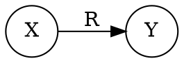

这个图表示从初始状态X到终止状态Y有一条标记为R的边。

### 转换规则 (图2-11)

#### 规则①：选择/并运算 (r1|r2)

**转换前：**
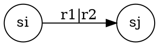

**转换后：**
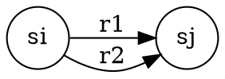

**说明：** 将选择运算分解为两条并行边。

#### 规则②：连接运算 (r1r2)

**转换前：**
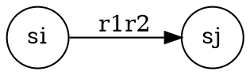

**转换后：**
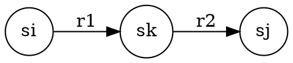

**说明：** 引入中间状态sk，将连接运算分解为两个顺序转换。

#### 规则③：闭包运算 (r1*)

**转换前：**
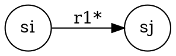

**转换后：**
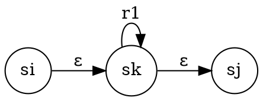

**说明：** 引入中间状态sk，使用ε转换和自环实现闭包运算。

## 构造过程

### 一般构造过程

对于给定的正则表达式R：

1. **初始表示**：首先按图2-10的形式表示，其中X为初始状态，Y为终止状态
2. **迭代应用规则**：然后迭代地应用图2-11中的三个转换规则
3. **添加新节点**：在此过程中不断添加新节点，分解边上的复杂标记
4. **终止条件**：直到图中每条有向边都标记为字母表Σ中的单个符号或ε为止
5. **构造完成**：此时NFA M的构造完成

### 构造步骤详解

#### 步骤1：分析正则表达式结构
- 识别选择运算 (|)
- 识别连接运算 (·)
- 识别闭包运算 (*)

#### 步骤2：自顶向下分解
- 从最外层的操作符开始
- 逐步分解到基本字符
- 记录每个子表达式的状态

#### 步骤3：自底向上构造
- 从基本字符开始构造NFA
- 根据操作符组合子NFA
- 逐步构建完整的NFA

## 实例分析

### 例2.6：构造正则表达式 b*(d|ad)(b|ab)* 的NFA

#### 步骤1：初始扩展转换图

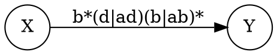

#### 步骤2：分解连接运算

将表达式分解为连接的部分：

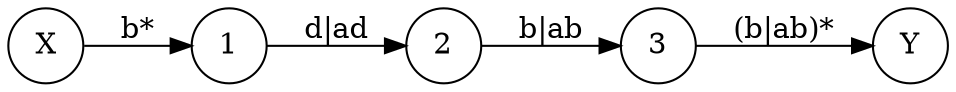

#### 步骤3：应用转换规则

**应用规则①：分解选择运算**

对 `d|ad` 和 `b|ab` 应用选择规则：

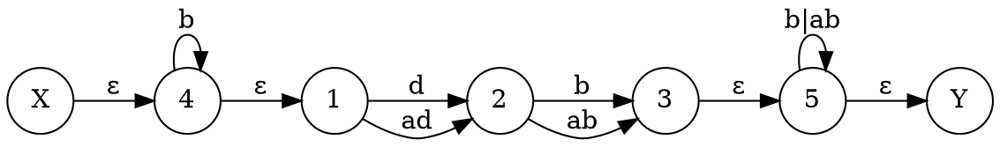

**应用规则②：分解连接运算**

分解 `ad` 和 `ab`：

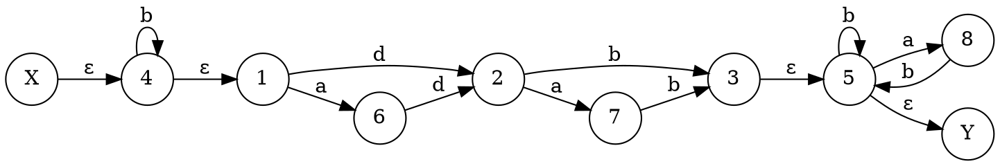

#### 步骤4：最终NFA

经过所有转换规则的应用，得到最终的NFA，其中所有边都标记为单个字符或ε。

## NFA的判定条件

注意，扩展后的状态转换图中如果存在以下两种情况之一，则为NFA M：

1. **存在ε边**：图中包含标记为ε的转换
2. **多值映射**：某节点对同一输入字符存在多条输出边（即为多值映射）

## 解题方法

### 方法1：扩展转换图法

1. **绘制初始图**：按图2-10绘制扩展转换图
2. **识别操作符**：找出选择(|)、连接(·)、闭包(*)操作符
3. **应用转换规则**：根据操作符类型应用相应的转换规则
4. **迭代分解**：重复应用规则直到所有边都标记为单个符号或ε

### 方法2：自顶向下分解法

1. **分析表达式结构**：从最外层操作符开始分析
2. **逐步分解**：将复杂表达式分解为简单表达式
3. **记录状态映射**：记录每个子表达式的状态
4. **组合构造**：根据操作符组合构造NFA

### 方法3：可视化验证法

1. **绘制NFA图**：在画布上绘制NFA状态图
2. **验证转换**：检查每个转换是否正确
3. **测试字符串**：用测试字符串验证NFA的正确性
4. **检查NFA条件**：验证是否满足NFA的判定条件

## 常见构造模式

### 1. 字符串匹配 "abc"

**扩展转换图：**
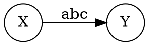

**应用规则②后：**
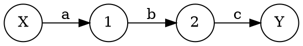

### 2. 选择模式 "a|b"

**扩展转换图：**
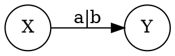

**应用规则①后：**
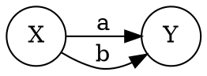

### 3. 重复模式 "a*"

**扩展转换图：**
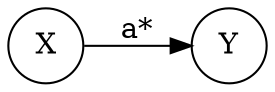

**应用规则③后：**
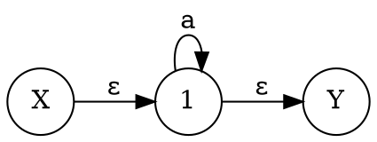

## 验证方法

### 1. 结构验证

- 检查是否有唯一的初始状态X
- 检查是否有唯一的终止状态Y
- 检查所有转换是否合理
- 验证是否满足NFA的判定条件

### 2. 功能验证

- 用测试字符串验证NFA
- 检查接受和拒绝的字符串
- 验证边界情况
- 测试ε转换的正确性

### 3. 转换规则验证

- 检查转换规则的应用是否正确
- 验证每个操作符的分解是否准确
- 确认所有复杂标记都已分解为单个符号或ε

## 常见错误

### 1. 转换规则应用错误

```
错误：错误应用转换规则
正确：根据操作符类型正确应用对应规则
```

### 2. 扩展转换图错误

```
错误：没有按图2-10绘制初始扩展转换图
正确：首先绘制从X到Y标记为R的扩展转换图
```

### 3. 分解顺序错误

```
错误：分解顺序不当
正确：从最外层操作符开始逐步分解
```

### 4. 终止条件判断错误

```
错误：过早停止分解
正确：直到所有边都标记为单个符号或ε
```

## 实践建议

1. **理解转换规则**：深入理解图2-11中三个转换规则的含义和应用
2. **掌握扩展转换图**：熟练绘制图2-10所示的扩展转换图
3. **逐步分解**：从简单表达式开始，逐步增加复杂度
4. **画图验证**：多画图验证构造的正确性
5. **测试验证**：用测试字符串验证NFA功能
6. **检查NFA条件**：确保满足NFA的判定条件

## 下一步

完成NFA构造后，您将进入下一步：**NFA的确定化**。在下一步中，您将学习如何使用子集构造法将NFA确定化为等价的DFA，提高自动机的执行效率。 