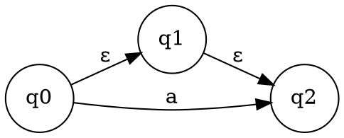
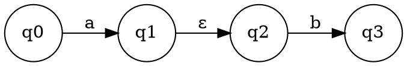
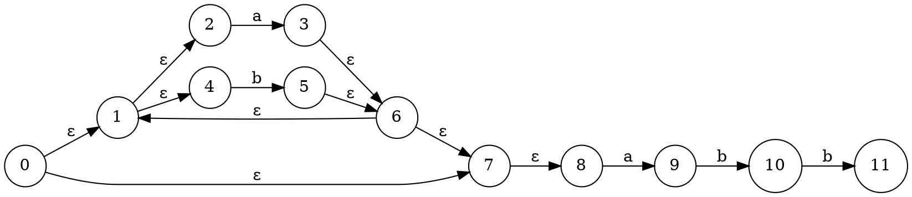

# 第三步：NFA的确定化 (子集构造法)

## 概述

NFA的确定化是指从给定的NFA M构造一个等价的DFA M'，使得L(M) = L(M')。子集构造法是实现这一目标的核心方法。

## 基本概念

### ε闭包 (ε_CLOSURE(I))

对于NFA M的状态子集I，ε闭包定义如下：

**(1)** 如果si ∈ I，则si ∈ ε_CLOSURE(I)

**(2)** 如果si ∈ I，则从si出发经过任意条ε有向边而能到达的任何状态sj ∈ ε_CLOSURE(I)

### 转移函数

对于状态子集I和字符a ∈ Σ，定义新状态Ia为：

Ia = ε_CLOSURE(J)

其中J是从I中任意状态出发经过一条标记为a的有向边而能到达的所有状态组成的集合。

**示例**：


对于状态q0：
- `ε-closure(q0) = {q0, q1, q2}`

#### 2. 转移函数 (Move)

转移函数计算从状态集合通过某个输入符号能够到达的所有状态。

**定义**：
- `move(T, a)` = {所有从T中任意状态通过输入a可达的状态}

**示例**：


对于状态集合{q0}和输入'a'：
- `move({q0}, a) = {q1}`

## 子集构造法步骤

用子集法对NFA M确定化的方法如下：

### (1) 构造转换表

构造一个转换表，第一列为状态子集I，对于每个不同的输入符号a (a ∈ Σ)，添加一列Ia。

### (2) 初始状态

转换表第一行第一列的状态子集为ε_CLOSURE(s₀)，其中s₀是NFA的初始状态。

### (3) 迭代构造

对于第一列中的每个状态子集I和每个输入符号a，计算Ia，并将Ia记录在对应的Ia列中。如果新找到的Ia在第一列I中尚未出现，则将其添加到第一列的新空行中。

### (4) 终止条件

重复步骤(3)，直到对每个I和a都计算了Ia，且第一列中不再添加新的状态子集。这个过程保证在有限步内终止。

### (5) 重新命名和最终DFA

对第一列中的每个状态子集重新命名，得到的表成为新的状态转换矩阵，对应的DFA M'。状态转换函数f是从S × Σ到S的单值映射，与原来的NFA M等价。

DFA的接受状态是包含NFA接受状态的DFA状态：
```
DFA接受状态 = {T | T ∩ NFA接受状态 ≠ ∅}
```

## 转换表构建

### 转换表结构

转换表记录从NFA状态集合到DFA状态的映射关系：

| DFA状态 | NFA状态集合 | 输入a | 输入b |
|---------|-------------|-------|-------|
| A       | {0,1,2}     | B     | C     |
| B       | {3,4}       | D     | E     |
| C       | {5}         | F     | G     |
| ...     | ...         | ...   | ...   |

### 填写规则

1. **状态集合表示**：多个状态用空格分隔，如 "1 2 3"
2. **转换目标**：填写目标DFA状态的编号
3. **无转换**：填写 "-" 表示无转换
4. **状态编号**：DFA状态按字母顺序编号（A, B, C, ...）

## 状态转换矩阵

### 矩阵结构

状态转换矩阵用数字编号表示状态间的转换关系：

| 状态 | a | b |
|------|---|---|
| A    | B | C |
| B    | D | E |
| C    | F | G |
| ...  | ... | ... |

### 填写规则

1. **行标题**：DFA状态编号
2. **列标题**：输入符号
3. **矩阵元素**：目标状态编号
4. **无转换**：填写 "-"

## 解题方法

### 方法1：手动计算法

1. **计算ε闭包**：
   - 从初始状态开始
   - 递归计算所有ε转换可达的状态

2. **计算转移函数**：
   - 对每个输入符号
   - 计算从当前状态集合的转移

3. **构建转换表**：
   - 记录每个DFA状态对应的NFA状态集合
   - 记录每个转换的目标状态

4. **构建转换矩阵**：
   - 将转换表转换为矩阵形式
   - 用数字编号表示状态

### 方法2：可视化跟踪法

1. **绘制NFA图**：在纸上绘制NFA状态图
2. **跟踪转换**：手动跟踪每个转换路径
3. **记录状态**：记录每个DFA状态对应的NFA状态集合
4. **验证结果**：检查转换的正确性

### 方法3：算法实现法

1. **实现ε闭包算法**：
   ```python
   def epsilon_closure(states):
       closure = set(states)
       stack = list(states)
       while stack:
           state = stack.pop()
           for next_state in epsilon_transitions[state]:
               if next_state not in closure:
                   closure.add(next_state)
                   stack.append(next_state)
       return closure
   ```

2. **实现转移函数**：
   ```python
   def move(states, symbol):
       result = set()
       for state in states:
           for next_state in transitions[state][symbol]:
               result.add(next_state)
       return result
   ```

3. **实现子集构造**：
   ```python
   def subset_construction(nfa):
       initial = epsilon_closure({nfa.initial_state})
       unprocessed = {initial}
       processed = set()
       dfa_states = {initial}
       
       while unprocessed:
           current = unprocessed.pop()
           processed.add(current)
           
           for symbol in alphabet:
               next_states = epsilon_closure(move(current, symbol))
               if next_states and next_states not in processed:
                   unprocessed.add(next_states)
                   dfa_states.add(next_states)
   ```

## 示例分析

### 示例：正则表达式 `(a|b)*abb`

#### 步骤1：NFA状态分析



#### 步骤2：计算ε闭包

- `ε-closure(0) = {0,1,2,4,7,8}`
- `ε-closure(3) = {3,6,1,2,4,7,8}`
- `ε-closure(5) = {5,6,1,2,4,7,8}`
- `ε-closure(9) = {9}`
- `ε-closure(10) = {10}`
- `ε-closure(11) = {11}`

#### 步骤3：构建转换表

| DFA状态 | NFA状态集合 | 输入a | 输入b |
|---------|-------------|-------|-------|
| A       | {0,1,2,4,7,8} | B | C |
| B       | {3,6,1,2,4,7,8,9} | B | D |
| C       | {5,6,1,2,4,7,8} | B | C |
| D       | {10} | E | F |
| E       | {11} | G | H |
| F       | {11} | G | H |
| G       | ∅ | - | - |
| H       | ∅ | - | - |

#### 步骤4：构建转换矩阵

| 状态 | a | b |
|------|---|---|
| A    | B | C |
| B    | B | D |
| C    | B | C |
| D    | E | F |
| E    | G | H |
| F    | G | H |
| G    | - | - |
| H    | - | - |

## 验证方法

### 1. 结构验证

- 检查每个DFA状态是否对应有效的NFA状态集合
- 检查转换是否完整且正确
- 检查接受状态的设置

### 2. 功能验证

- 用测试字符串验证DFA
- 比较NFA和DFA的接受语言
- 验证边界情况

### 3. 数量验证

- 检查DFA状态数量是否合理
- 验证转换的完整性
- 检查是否有冗余状态

## 常见错误

### 1. ε闭包计算错误

```
错误：遗漏某些ε转换可达的状态
正确：递归计算所有ε转换可达的状态
```

### 2. 状态集合表示错误

```
错误：状态之间没有空格分隔
正确：状态之间用空格分隔，如 "1 2 3"
```

### 3. 转换记录错误

```
错误：遗漏某些转换或记录错误的转换
正确：确保每个输入符号都有对应的转换记录
```

### 4. 接受状态设置错误

```
错误：DFA接受状态设置不正确
正确：包含NFA接受状态的DFA状态才是接受状态
```

## 实践建议

1. **从简单开始**：先练习简单的NFA转换
2. **画图辅助**：在纸上绘制NFA图辅助理解
3. **逐步计算**：按步骤计算ε闭包和转移函数
4. **验证结果**：用测试字符串验证转换的正确性
5. **理解原理**：深入理解子集构造法的原理

## 下一步

完成子集构造后，您将进入下一步：**DFA可视化**。在下一步中，您将学习如何将DFA转换为可视化的状态图。 