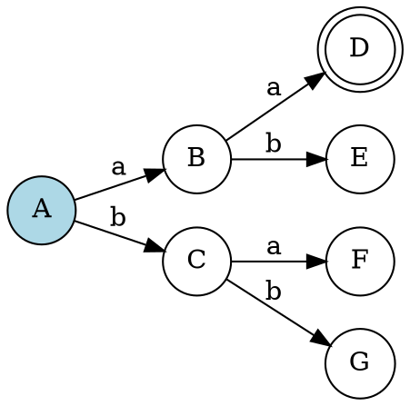
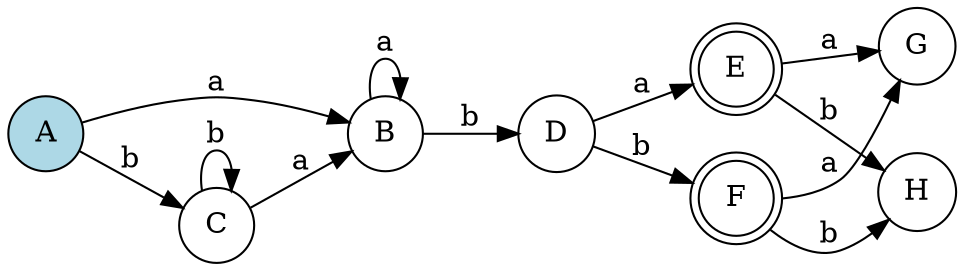

# 第四步：DFA可视化

## 概述

DFA可视化是将确定有限自动机的转换表和状态转换矩阵转换为直观的状态图的过程。本步骤将学习如何根据转换表绘制DFA图。

## DFA图的基本元素

### 1. 状态节点

- **初始状态**：通常用双圆圈或特殊标记表示
- **普通状态**：用单圆圈表示
- **接受状态**：用双圆圈表示
- **状态标签**：在圆圈内显示状态名称

### 2. 转换边

- **有向边**：表示状态间的转换
- **边标签**：显示触发转换的输入符号
- **多重边**：多个输入符号可以共享同一条边

### 3. 图布局

- **从左到右**：通常初始状态在左侧
- **层次结构**：按转换层次组织状态
- **清晰布局**：避免边的交叉和重叠

## 绘制步骤

### 步骤1：分析转换表

1. **识别状态**：
   - 列出所有DFA状态
   - 确定初始状态和接受状态

2. **分析转换**：
   - 记录每个状态的转换关系
   - 识别输入符号和对应的目标状态

### 步骤2：绘制状态节点

1. **初始状态**：
   ```dot
   digraph G {
       rankdir=LR;
       node [shape=circle];
       q0 [label="A", style=filled, fillcolor=lightblue];
   }
   ```

2. **普通状态**：
   ```dot
   digraph G {
       rankdir=LR;
       node [shape=circle];
       q1 [label="B"];
       q2 [label="C"];
   }
   ```

3. **接受状态**：
   ```dot
   digraph G {
       rankdir=LR;
       node [shape=doublecircle];
       q3 [label="D"];
   }
   ```

### 步骤3：绘制转换边

1. **基本转换**：
   ```dot
   digraph G {
       rankdir=LR;
       node [shape=circle];
       q0 [label="A"];
       q1 [label="B"];
       q0 -> q1 [label="a"];
   }
   ```

2. **多重转换**：
   ```dot
   digraph G {
       rankdir=LR;
       node [shape=circle];
       q0 [label="A"];
       q1 [label="B"];
       q0 -> q1 [label="a,b"];
   }
   ```

3. **自环转换**：
   ```dot
   digraph G {
       rankdir=LR;
       node [shape=circle];
       q0 [label="A"];
       q0 -> q0 [label="a"];
   }
   ```

## 转换表到DFA图的映射

### 转换表结构

| DFA状态 | NFA状态集合 | 输入a | 输入b |
|---------|-------------|-------|-------|
| A       | {0,1,2}     | B     | C     |
| B       | {3,4}       | D     | E     |
| C       | {5}         | F     | G     |

### 对应的DFA图



## 解题方法

### 方法1：表格映射法

1. **创建状态映射**：
   - 为每个DFA状态分配节点
   - 确定初始状态和接受状态

2. **绘制转换边**：
   - 根据转换表绘制有向边
   - 标注输入符号

3. **优化布局**：
   - 调整节点位置
   - 减少边的交叉

### 方法2：层次构造法

1. **按层次组织**：
   - 初始状态在第一层
   - 按转换深度组织后续状态

2. **逐步构建**：
   - 从初始状态开始
   - 逐步添加可达状态

3. **验证完整性**：
   - 检查所有转换是否表示
   - 验证接受状态的正确性

### 方法3：可视化验证法

1. **绘制草图**：
   - 在纸上绘制初步的DFA图
   - 标记状态和转换

2. **验证转换**：
   - 用测试字符串验证路径
   - 检查转换的正确性

3. **优化布局**：
   - 调整节点位置
   - 改善图的可读性

## 示例分析

### 示例：正则表达式 `(a|b)*abb`

#### 转换表

| DFA状态 | NFA状态集合 | 输入a | 输入b |
|---------|-------------|-------|-------|
| A       | {0,1,2,4,7,8} | B | C |
| B       | {3,6,1,2,4,7,8,9} | B | D |
| C       | {5,6,1,2,4,7,8} | B | C |
| D       | {10} | E | F |
| E       | {11} | G | H |
| F       | {11} | G | H |

#### 对应的DFA图



## 验证方法

### 1. 结构验证

- 检查所有状态是否都表示
- 验证转换的完整性
- 检查初始状态和接受状态的设置

### 2. 功能验证

- 用测试字符串验证DFA
- 检查接受和拒绝的字符串
- 验证边界情况

### 3. 可视化验证

- 检查图的清晰度
- 验证边的标注
- 确保布局合理

## 常见错误

### 1. 状态遗漏

```
错误：遗漏某些DFA状态
正确：确保所有转换表中的状态都在图中表示
```

### 2. 转换错误

```
错误：转换关系不正确
正确：严格按照转换表绘制转换边
```

### 3. 接受状态设置错误

```
错误：接受状态设置不正确
正确：根据NFA状态集合确定DFA接受状态
```

### 4. 布局混乱

```
错误：节点和边的布局混乱
正确：采用清晰的层次布局，减少交叉
```

## 实践建议

1. **从简单开始**：先练习简单的DFA绘制
2. **逐步复杂**：逐渐增加状态数量和转换复杂度
3. **画图验证**：多画图验证转换的正确性
4. **测试验证**：用测试字符串验证DFA功能
5. **理解原理**：深入理解DFA的结构和功能

## 下一步

完成DFA可视化后，您将进入下一步：**DFA最小化**。在下一步中，您将学习如何最小化DFA，减少状态数量，提高效率。 