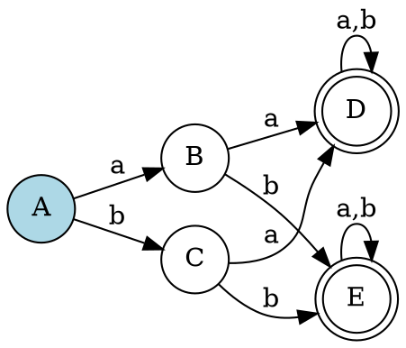
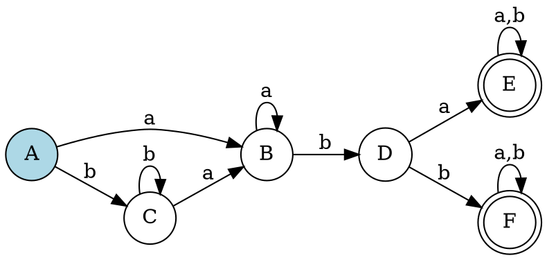
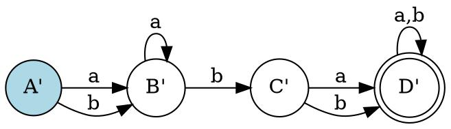

# 第五步：确定有限自动机(DFA)的化简

## 概述

将NFA确定化为DFA后，得到的DFA可能包含冗余状态，需要进行化简。DFA的化简是指寻找一个状态数少于原DFA M的DFA M'，使得L(M) = L(M')。

## 化简条件

最简DFA M'应满足以下条件：

**(1)** 无冗余状态

**(2)** 其状态集中无两个等价状态

## 等价状态定义

两个不同的状态s₁和s₂等价，当且仅当对于任意输入串，它们要么都到达终态，要么都到达非终态。如果对于某个串，一个到达终态而另一个到达非终态，则称这两个状态是可区分的。

## DFA化简方法

### 化简过程概述

DFA的化简过程是将DFA的状态集S划分为互不相交的子集，使得同一子集中的状态等价，不同子集中的状态可区分。最终的最简DFA是从每个子集中选择一个代表状态，删除其他状态而得到的。

### DFA化简步骤

#### (1) 初始划分

首先将DFA M的状态集S划分为两个基本子集：终态和非终态。

#### (2) 迭代细化

对于当前划分I(1), I(2), ..., I(m)（其中不同子集中的状态是可区分的），检查是否有子集I可以进一步划分。

具体地，对于子集I = {s₁, s₂, ..., sₖ}，如果存在输入字符a，使得从s₁, s₂, ..., sₖ出发经过a到达的状态（记为I(a)）不全包含在当前划分的某个单一子集中（即"跨越"到不同子集），则将I划分为两个或更多新的子集。这个过程如图2-16所示。

#### (3) 终止条件

重复步骤(2)，直到不能再划分任何子集，即子集数量不再增加。此时，每个子集代表一组不可进一步区分的等价状态。

## 解题方法

### 方法1：手动计算法

#### 步骤1：识别初始分区

**示例DFA**：


**初始分区**：
- 接受状态：{D, E}
- 非接受状态：{A, B, C}

#### 步骤2：计算前驱状态

**对于输入'a'**：
- Pre({D, E}, a) = {B, C, D, E}

**对于输入'b'**：
- Pre({D, E}, b) = {B, C, D, E}

#### 步骤3：细化分区

**分割非接受状态集合{A, B, C}**：
- {A, B, C} ∩ {B, C, D, E} = {B, C}
- {A, B, C} - {B, C, D, E} = {A}

**新的分区**：
- {A}
- {B, C}
- {D, E}

#### 步骤4：验证等价性

检查{B, C}是否等价：
- 状态B：输入a→D，输入b→E
- 状态C：输入a→D，输入b→E
- 转换相同，所以B和C等价

#### 步骤5：构建最小DFA

**状态映射**：
- {A} → A'
- {B, C} → B'
- {D, E} → C'

**转换关系**：
- A' → B' (a)
- A' → B' (b)
- B' → C' (a)
- B' → C' (b)
- C' → C' (a,b)

### 方法2：表格法

#### 步骤1：构建等价性表格

| 状态对 | 输入a | 输入b | 等价性 |
|--------|-------|-------|--------|
| A-B    | D-D   | E-E   | ✓      |
| A-C    | D-D   | E-E   | ✓      |
| B-C    | D-D   | E-E   | ✓      |

#### 步骤2：识别等价状态

根据表格，B和C是等价的。

#### 步骤3：合并状态

将B和C合并为一个状态B'。

### 方法3：可视化法

#### 步骤1：绘制原DFA

在纸上绘制原DFA图。

#### 步骤2：标记等价状态

用相同颜色标记等价的状态。

#### 步骤3：合并状态

将等价状态合并为一个状态。

#### 步骤4：重绘最小DFA

根据合并结果重绘DFA图。

## 示例分析

### 示例：正则表达式 `(a|b)*abb`

#### 原DFA



#### 最小化过程

**步骤1：初始分区**
- 接受状态：{E, F}
- 非接受状态：{A, B, C, D}

**步骤2：计算前驱**
- Pre({E, F}, a) = {D}
- Pre({E, F}, b) = {D}

**步骤3：分割分区**
- {A, B, C, D} ∩ {D} = {D}
- {A, B, C, D} - {D} = {A, B, C}

**步骤4：进一步分割**
- 检查{A, B, C}的等价性
- 发现B和C等价（转换相同）
- 最终分区：{A}, {B, C}, {D}, {E, F}

#### 最小化DFA



## 验证方法

### 1. 功能等价性验证

- 用相同的测试字符串验证原DFA和最小化DFA
- 确保接受和拒绝的字符串集合相同

### 2. 状态数量验证

- 检查最小化DFA的状态数量是否确实减少
- 验证没有不必要的状态

### 3. 转换完整性验证

- 检查所有转换是否正确
- 验证没有遗漏的转换

## 常见错误

### 1. 等价性判断错误

```
错误：错误地认为两个状态等价
正确：仔细检查所有输入符号的转换
```

### 2. 分区错误

```
错误：分区不正确
正确：严格按照算法进行分区
```

### 3. 转换映射错误

```
错误：转换关系映射错误
正确：根据原DFA的转换关系确定新DFA的转换
```

### 4. 接受状态设置错误

```
错误：接受状态设置不正确
正确：包含原接受状态的分区才是接受状态
```

## 实践建议

1. **从简单开始**：先练习简单的DFA最小化
2. **逐步复杂**：逐渐增加状态数量和复杂度
3. **画图辅助**：在纸上绘制DFA图辅助理解
4. **验证结果**：用测试字符串验证最小化的正确性
5. **理解原理**：深入理解等价状态的概念

## 下一步

完成DFA最小化后，您将进入下一步：**最小化DFA可视化**。在下一步中，您将学习如何将最小化的DFA转换为可视化的状态图。 