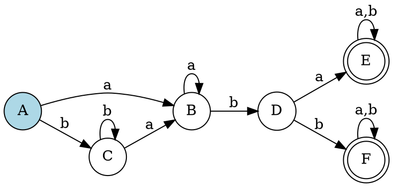
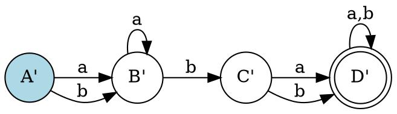

# 第六步：最小化DFA可视化

## 概述

最小化DFA可视化是将经过最小化处理的确定有限自动机转换为直观的状态图的过程。本步骤将学习如何绘制最小化后的DFA图，展示优化后的自动机结构。

## 最小化DFA的特点

### 1. 状态数量减少

- 合并了等价状态
- 消除了冗余状态
- 保持了功能等价性

### 2. 结构更简洁

- 转换关系更清晰
- 减少了不必要的复杂性
- 提高了执行效率

### 3. 功能完全等价

- 接受相同的语言
- 拒绝相同的字符串
- 行为与原DFA一致

## 绘制步骤

### 步骤1：分析最小化结果

1. **识别合并的状态**：
   - 查看哪些原状态被合并
   - 确定新的状态名称

2. **分析转换关系**：
   - 记录新的转换关系
   - 确定输入符号和对应的目标状态

### 步骤2：绘制状态节点

1. **初始状态**：
   ```dot
   digraph G {
       rankdir=LR;
       node [shape=circle];
       q0 [label="A'", style=filled, fillcolor=lightblue];
   }
   ```

2. **普通状态**：
   ```dot
   digraph G {
       rankdir=LR;
       node [shape=circle];
       q1 [label="B'"];
       q2 [label="C'"];
   }
   ```

3. **接受状态**：
   ```dot
   digraph G {
       rankdir=LR;
       node [shape=doublecircle];
       q3 [label="D'"];
   }
   ```

### 步骤3：绘制转换边

1. **基本转换**：
   ```dot
   digraph G {
       rankdir=LR;
       node [shape=circle];
       q0 [label="A'"];
       q1 [label="B'"];
       q0 -> q1 [label="a"];
   }
   ```

2. **多重转换**：
   ```dot
   digraph G {
       rankdir=LR;
       node [shape=circle];
       q0 [label="A'"];
       q1 [label="B'"];
       q0 -> q1 [label="a,b"];
   }
   ```

3. **自环转换**：
   ```dot
   digraph G {
       rankdir=LR;
       node [shape=circle];
       q1 [label="B'"];
       q1 -> q1 [label="a"];
   }
   ```

## 对比分析

### 原DFA vs 最小化DFA

#### 状态数量对比

| 特征 | 原DFA | 最小化DFA |
|------|-------|-----------|
| 状态数量 | 6个 | 4个 |
| 转换数量 | 12个 | 8个 |
| 复杂度 | 高 | 低 |

#### 结构对比

**原DFA**：


**最小化DFA**：


## 解题方法

### 方法1：状态映射法

1. **创建状态映射**：
   - 将原状态集合映射到新状态
   - 确定初始状态和接受状态

2. **绘制转换边**：
   - 根据最小化结果绘制有向边
   - 标注输入符号

3. **优化布局**：
   - 调整节点位置
   - 减少边的交叉

### 方法2：对比构造法

1. **对比原DFA**：
   - 分析原DFA的结构
   - 识别被合并的状态

2. **应用合并规则**：
   - 将等价状态合并为一个节点
   - 调整转换关系

3. **验证结果**：
   - 检查转换的正确性
   - 验证功能的等价性

### 方法3：算法实现法

1. **实现最小化算法**：
   ```python
   def minimize_dfa(dfa):
       # 应用Hopcroft算法
       partitions = hopcroft_algorithm(dfa)
       
       # 构建最小DFA
       minimized_dfa = build_minimized_dfa(dfa, partitions)
       
       return minimized_dfa
   ```

2. **生成可视化**：
   ```python
   def visualize_minimized_dfa(minimized_dfa):
       # 生成DOT代码
       dot_code = generate_dot_code(minimized_dfa)
       
       # 渲染图形
       render_graph(dot_code)
   ```

## 示例分析

### 示例：正则表达式 `(a|b)*abb`

#### 最小化过程

**原DFA状态**：
- A: {0,1,2,4,7,8}
- B: {3,6,1,2,4,7,8,9}
- C: {5,6,1,2,4,7,8}
- D: {10}
- E: {11}
- F: {11}

**等价性分析**：
- B和C等价（转换相同）
- E和F等价（都是接受状态，转换相同）

**最小化结果**：
- A': {A}
- B': {B, C}
- C': {D}
- D': {E, F}

#### 最小化DFA图


## 验证方法

### 1. 功能等价性验证

- 用相同的测试字符串验证原DFA和最小化DFA
- 确保接受和拒绝的字符串集合相同

### 2. 状态数量验证

- 检查最小化DFA的状态数量是否确实减少
- 验证没有不必要的状态

### 3. 转换完整性验证

- 检查所有转换是否正确
- 验证没有遗漏的转换

### 4. 可视化验证

- 检查图的清晰度
- 验证边的标注
- 确保布局合理

## 常见错误

### 1. 状态合并错误

```
错误：错误地合并了不等价的状态
正确：只合并真正等价的状态
```

### 2. 转换映射错误

```
错误：转换关系映射错误
正确：根据最小化结果正确映射转换关系
```

### 3. 接受状态设置错误

```
错误：接受状态设置不正确
正确：包含原接受状态的分区才是接受状态
```

### 4. 布局混乱

```
错误：节点和边的布局混乱
正确：采用清晰的层次布局，减少交叉
```

## 优化技巧

### 1. 布局优化

- 使用层次布局
- 减少边的交叉
- 保持图的对称性

### 2. 标签优化

- 使用清晰的状态标签
- 合并相同的转换标签
- 避免标签重叠

### 3. 颜色编码

- 用不同颜色区分状态类型
- 用颜色标记转换路径
- 提高图的可读性

## 实践建议

1. **从简单开始**：先练习简单的DFA最小化可视化
2. **逐步复杂**：逐渐增加状态数量和转换复杂度
3. **画图验证**：多画图验证最小化的正确性
4. **测试验证**：用测试字符串验证功能等价性
5. **理解原理**：深入理解最小化的原理和意义

## 总结

通过本模块的学习，您已经掌握了：

1. **正则表达式的输入和验证**
2. **Thompson构造法构建NFA**
3. **子集构造法将NFA转换为DFA**
4. **DFA的可视化表示**
5. **DFA最小化算法**
6. **最小化DFA的可视化**

这些知识为您进一步学习编译原理奠定了坚实的基础。有限自动机是词法分析器设计的核心，掌握这些技术对于理解编译器的工作原理至关重要。 