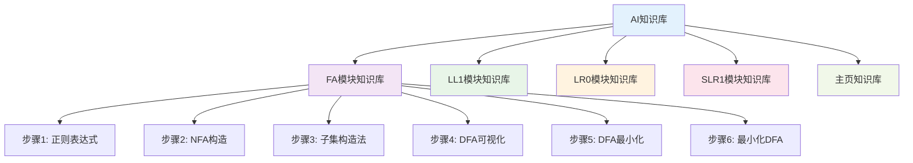
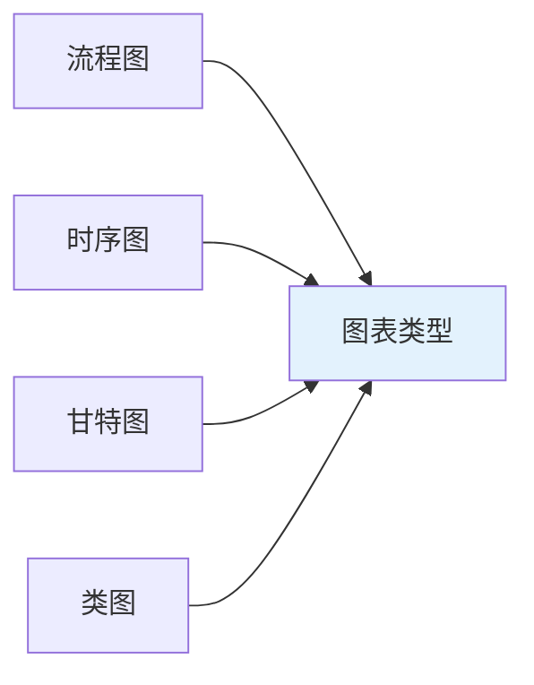
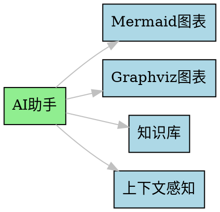

# AI智能助手功能概述

欢迎了解我们平台的AI智能助手功能！这是一个专为编译原理学习设计的智能教学助手，能够根据您的学习进度和需求提供个性化的帮助。

## 🎯 AI助手特色功能

### 与普通AI聊天的核心区别

**传统AI聊天的问题**：
- 缺乏上下文理解
- 回答过于通用
- 无法生成可视化图表
- 没有专业知识库支持

**我们的AI助手优势**：
- **上下文感知**：能够理解您当前的学习页面和步骤
- **专业领域知识**：内置编译原理专业知识库
- **图表生成能力**：支持Mermaid和Graphviz精美图表
- **个性化指导**：根据您的学习进度提供针对性建议

## 🧠 智能知识库系统

### 步骤化知识库

我们的AI系统为每个学习模块都建立了专门的知识库：

### 实时上下文感知

AI助手能够实时感知：

- **当前页面**：您正在学习的模块和步骤
- **用户输入**：您在页面中输入的数据
- **后端数据**：系统返回的计算结果
- **学习进度**：您的答题记录和完成情况

## 🎨 图表生成功能

### Mermaid图表支持

AI可以生成多种类型的Mermaid图表：

**支持的图表类型**：
- **流程图**：展示算法流程、决策过程
- **时序图**：展示交互时序、消息传递
- **甘特图**：展示项目进度、时间安排
- **类图**：展示类关系、对象结构
- **状态图**：展示状态转换、状态机
- **饼图**：展示数据分布、比例关系

### Graphviz DOT图表支持

AI还可以生成专业的Graphviz DOT图表：

**支持的图表类型**：
- **自动机图**：DFA、NFA、PDA等状态图
- **语法树**：抽象语法树、语法分析树
- **网络拓扑图**：计算机网络、系统架构
- **数据库ER图**：实体关系、数据模型

### 智能图表选择

AI会根据内容类型智能选择最合适的图表：

  

    <h4 style="color: #1e40af; margin: 0 0 0.5rem 0;">使用Mermaid的情况</h4>
    <ul style="margin: 0; color: #374151;">
      <li>算法流程图</li>
      <li>决策过程</li>
      <li>时序交互</li>
      <li>项目进度</li>
    </ul>
  

  

    <h4 style="color: #047857; margin: 0 0 0.5rem 0;">使用Graphviz的情况</h4>
    <ul style="margin: 0; color: #374151;">
      <li>自动机状态图</li>
      <li>语法分析树</li>
      <li>网络拓扑</li>
      <li>系统架构</li>
    </ul>
  

## 💬 智能对话功能

### 预设问题系统

每个模块都有专门的预设问题：

**FA模块预设问题**：
- 这个正则表达式是什么意思？
- NFA和DFA有什么区别？
- 为什么要进行DFA最小化？
- 子集构造法的步骤是什么？

**LL1模块预设问题**：
- 什么是First集和Follow集？
- 如何判断一个文法是否是LL1文法？
- LL1分析表的构建过程是什么？

**LR0模块预设问题**：
- LR0分析的基本思想是什么？
- 项目集规范族是如何构造的？
- 什么是移进-归约冲突？

### 流式响应

- **实时输出**：支持流式文本输出，模拟真实对话
- **打字机效果**：流畅的打字机效果，提升用户体验
- **中断支持**：支持用户中断AI回答

## 🔧 技术实现特色

### 深度集成

### 智能上下文管理

- **自动清理**：智能管理对话历史，避免上下文过长
- **上下文压缩**：优化长期记忆机制
- **状态同步**：与页面状态实时同步

### 多模态交互

- **文本输入**：支持自然语言输入
- **图表生成**：自动生成解释图表
- **代码高亮**：支持代码语法高亮
- **数学公式**：支持LaTeX数学公式

## 🎯 使用场景

### 学习辅助

- **概念解释**：遇到不懂的概念时，AI会提供详细解释
- **步骤指导**：在操作步骤时，AI会提供具体指导
- **错误分析**：当出现错误时，AI会分析原因并提供解决方案

### 知识扩展

- **深度理解**：AI会提供更深层次的理论解释
- **实际应用**：AI会举例说明理论在实际中的应用
- **知识关联**：AI会帮助您理解不同概念之间的联系

### 学习建议

- **个性化建议**：根据您的学习情况提供针对性建议
- **学习路径**：推荐适合您的学习路径
- **复习提醒**：提醒您复习重要的概念

## 💡 使用技巧

### 如何获得最佳体验

1. **明确问题**：描述您的问题要具体明确
2. **利用上下文**：AI会根据您的当前页面提供更准确的回答
3. **请求图表**：当需要可视化解释时，主动请求AI生成图表
4. **深入探讨**：不要满足于表面回答，可以继续追问

### 提问技巧

- **具体描述**：描述您遇到的具体问题
- **提供背景**：说明您当前的学习进度
- **请求示例**：要求AI提供具体的例子
- **寻求解释**：要求AI解释背后的原理

## 🔧 操作指南

### 如何打开AI助手

  <h4 style="color: #7c3aed; margin: 0 0 0.5rem 0;">操作步骤</h4>
  <ol style="margin: 0; color: #374151;">
    <li>在页面右下角找到AI助手图标</li>
    <li>点击图标打开聊天窗口</li>
    <li>在输入框中输入您的问题</li>
    <li>按Enter键发送消息</li>
    <li>等待AI的智能回答</li>
  </ol>

### 快捷键支持

- `Ctrl/Cmd + Shift + A`：快速打开/关闭AI助手
- `ESC`：关闭聊天窗口
- `Enter`：发送消息
- `Ctrl + Enter`：换行

### 图表操作

- **图片/代码切换**：点击图表上方的标签页切换视图
- **下载图表**：点击下载按钮保存图表
- **复制内容**：点击复制按钮复制图表代码
- **全屏查看**：点击全屏按钮放大查看

## 📚 下一步

现在您已经了解了AI助手的功能，建议您：

1. **立即体验**：在任意页面打开AI助手进行体验
2. **尝试提问**：询问您遇到的编译原理问题
3. **请求图表**：让AI生成可视化图表来解释概念
4. **深入交流**：与AI进行深入的学习讨论

AI助手将成为您学习编译原理的得力助手，帮助您更好地理解和掌握这些抽象的概念！

准备好开始您的智能学习之旅了吗？点击右下角的AI图标，开始与AI助手对话吧！ 