# 从有限自动机到正则表达式的转换

## 概述

采用如图2-34所示的三条转换规则可以实现从有限自动机(FA) M到正则表达式的转换。这些规则提供了将复杂的自动机结构简化为正则表达式的系统方法。

## 转换规则 (图2-34)

### 规则①：并行转换 (选择运算)

**转换前：**
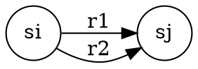

**转换后：**
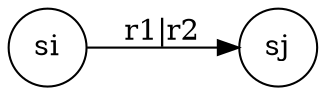

**说明：** 两条从状态si到状态sj的并行转换可以合并为一条标记为r1|r2的转换。

### 规则②：顺序转换 (连接运算)

**转换前：**
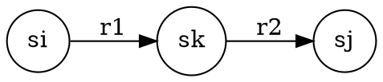

**转换后：**
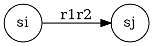

**说明：** 通过中间状态sk的顺序转换可以合并为一条标记为r1r2的转换。

### 规则③：自环转换 (闭包运算)

**转换前：**
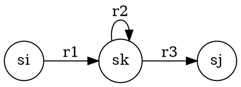

**转换后：**
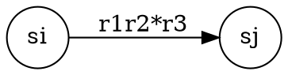

**说明：** 中间状态sk上的自环标记r2在合并后的正则表达式中变为r2*（Kleene闭包）。

## 转换过程

### 步骤1：识别转换模式

1. **识别并行转换**：找出从同一状态到同一状态的多条转换
2. **识别顺序转换**：找出通过中间状态的顺序转换
3. **识别自环转换**：找出带有自环的中间状态

### 步骤2：应用转换规则

1. **应用规则①**：合并并行转换
2. **应用规则②**：合并顺序转换
3. **应用规则③**：处理自环转换

### 步骤3：迭代简化

重复应用转换规则，直到自动机简化为从初始状态到终止状态的单一转换。

## 应用示例

### 示例1：简单选择

**原始自动机：**
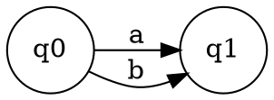

**应用规则①后：**
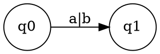

**结果：** 正则表达式 `a|b`

### 示例2：简单连接

**原始自动机：**
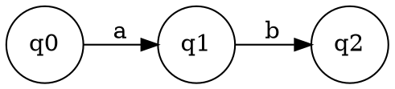

**应用规则②后：**
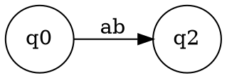

**结果：** 正则表达式 `ab`

### 示例3：带自环的转换

**原始自动机：**
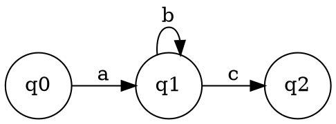

**应用规则③后：**
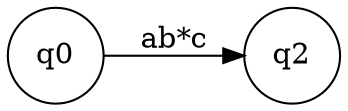

**结果：** 正则表达式 `ab*c`

## 复杂示例

### 示例：构造等价性证明

**问题：** 证明正则表达式 `(a|b)*` 与 `(a*b*)*` 等价

**方法：** 构造两个表达式的DFA，然后使用转换规则将它们转换为相同的正则表达式。

#### 步骤1：构造 `(a|b)*` 的DFA

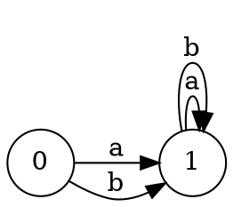

#### 步骤2：应用转换规则

1. **应用规则①**：合并并行转换
   ```
   q0 -> q1: a|b
   q1 -> q1: a|b
   ```

2. **应用规则③**：处理自环
   ```
   q0 -> q1: (a|b)
   q1 -> q1: (a|b)*
   ```

3. **应用规则②**：合并顺序转换
   ```
   q0 -> q1: (a|b)(a|b)*
   ```

**结果：** `(a|b)(a|b)*` = `(a|b)*`

#### 步骤3：构造 `(a*b*)*` 的DFA

类似地，可以构造 `(a*b*)*` 的DFA并应用转换规则，最终得到相同的结果。

## 验证方法

### 1. 功能验证

- 用测试字符串验证转换前后的自动机
- 检查接受和拒绝的字符串是否一致
- 验证边界情况

### 2. 结构验证

- 检查转换规则的应用是否正确
- 验证正则表达式的语法
- 确认转换的完整性

### 3. 等价性验证

- 比较转换前后的语言
- 使用数学方法证明等价性
- 通过DFA最小化验证

## 常见错误

### 1. 规则应用顺序错误

```
错误：先应用规则③再应用规则②
正确：先应用规则②再应用规则③
```

### 2. 自环处理错误

```
错误：忽略自环的闭包性质
正确：将自环转换为Kleene闭包
```

### 3. 并行转换遗漏

```
错误：遗漏某些并行转换
正确：识别所有并行转换并合并
```

## 实践建议

1. **理解规则**：深入理解三个转换规则的含义
2. **逐步应用**：按照规则顺序逐步应用
3. **验证结果**：用测试用例验证转换的正确性
4. **练习复杂案例**：多练习复杂的自动机转换
5. **对比分析**：比较不同转换路径的结果

## 应用场景

- **编译器设计**：将自动机转换为正则表达式
- **模式匹配**：优化正则表达式的性能
- **语言理论**：证明语言的等价性
- **算法分析**：分析自动机的复杂度 