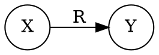
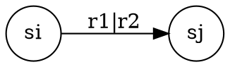
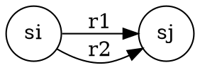
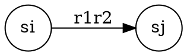
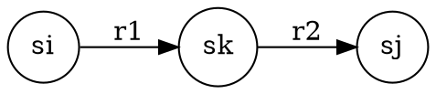
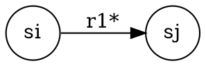
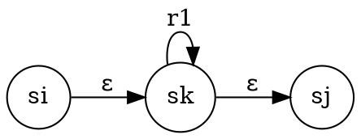

# 第二步：NFA构造

欢迎来到有限自动机学习的第二步！在这一步中，您将学习如何将正则表达式转换为非确定有限自动机（NFA），并使用交互式画图工具进行可视化构造。

## 📝 页面功能概述

### 主要功能
- **交互式NFA绘制**：使用专业的画图组件构造NFA
- **实时可视化**：直观展示正则表达式到NFA的转换过程
- **标准答案对比**：查看系统生成的正确NFA进行自我验证
- **自动保存**：画布数据自动保存，避免丢失

### 学习目标
- 掌握NFA构造的基本原理
- 学会使用画图工具绘制自动机
- 理解正则表达式与NFA的对应关系
- 培养自我验证和纠错能力

## 🎨 界面布局与操作指南

### 页面结构

  <h4 style="color: #7c3aed; margin: 0 0 0.5rem 0;">页面布局说明</h4>
  

    

      <strong>上方：用户绘制区域</strong>
      <ul style="margin: 0.5rem 0 0 0; padding-left: 1.5rem;">
        <li>交互式画布（700px高度）</li>
        <li>FA_vueflow画图组件</li>
        <li>绘制提示信息</li>
      </ul>
    

    

      <strong>下方：标准答案区域</strong>
      <ul style="margin: 0.5rem 0 0 0; padding-left: 1.5rem;">
        <li>答案显示/隐藏控制</li>
        <li>SVG格式的标准NFA图</li>
        <li>构造分析说明</li>
      </ul>
    

  

### 头部信息栏

  

    

      

        🌿
      

      

        <h2 style="margin: 0; font-size: 1.5rem; font-weight: bold; color: #111827;">构造 NFA</h2>
        
第二步：将正则表达式转换为非确定有限自动机

      

    

    

      正则表达式: <code style="font-family: monospace; font-weight: bold;">(a|b)*abb</code>
    

  

### 绘制提示区域

  

    💡
    

      <h4 style="margin: 0 0 0.5rem 0; font-weight: 500; color: #1e40af;">绘制提示</h4>
      <ul style="margin: 0; color: #1e40af; font-size: 0.875rem; line-height: 1.5;">
        <li>• 使用NFA构造法构造NFA</li>
        <li>• 为每个基本符号创建状态和转换</li>
        <li>• 处理连接、选择和闭包操作</li>
        <li>• 确保有明确的初始状态和接受状态</li>
        <li>• 完成绘制后可点击右下方"查看答案"按钮，显示正确答案后，请自行检验NFA构造的正确性</li>
      </ul>
    

  

### 答案控制区域

  

    <h3 style="margin: 0; font-weight: 600; color: #111827;">标准答案</h3>
    <button style="background: #059669; color: white; padding: 0.5rem 1rem; border-radius: 0.5rem; border: none; display: flex; align-items: center; gap: 0.5rem; font-size: 0.875rem;">
      👁️
      查看答案
    </button>
  

  

    

      🔒
      
答案已隐藏

      
完成你的绘制后点击"查看答案"按钮

    

  

## 🔍 自我验证流程

### 验证步骤

1. **完成绘制**：使用画图工具完成NFA构造
2. **查看答案**：点击"查看答案"按钮显示标准NFA
3. **对比检查**：仔细对比自己绘制的NFA与标准答案
4. **发现问题**：识别构造中的错误和不足
5. **修正改进**：根据标准答案修正自己的构造
6. **再次验证**：重复检查直到构造正确

### 验证要点

**状态检查**：
- 状态数量是否正确
- 初始状态是否唯一且正确
- 接受状态是否完整

**转换检查**：
- 转换符号是否正确
- 转换方向是否准确
- ε转换是否合理

**结构检查**：
- 整体结构是否符合NFA特征
- 是否覆盖了所有输入情况
- 是否存在冗余或缺失 

## 🎨 画图组件使用指南

### 工具栏功能

  <h4 style="margin: 0 0 0.5rem 0; color: #374151;">工具栏按钮说明</h4>
  

    

      ➕
      添加节点
    

    

      ▶️
      设置初态
    

    

      ⭕
      设置终态
    

    

      🔄
      重置画布
    

  

**功能详解**：

- **添加节点**：点击按钮在画布上添加新的状态节点，系统会自动分配编号
- **设置初态**：选中一个节点后点击，将其设为初始状态（NFA可以有多个初态）
- **设置终态**：选中一个或多个节点后点击，将其设为接受状态
- **重置画布**：清空所有节点和边，重新开始绘制

### 画布操作

#### 1. 创建状态节点

**方法一：工具栏按钮**
- 点击"添加节点"按钮
- 系统自动在随机位置创建新节点
- 节点编号自动分配（从0开始，跳过已使用的编号）

**方法二：双击画布**
- 双击画布空白处
- 在双击位置创建新节点
- 同样自动分配编号

#### 2. 连接状态

**创建转换边**：
- 拖拽节点上的连接点（小圆点）
- 拖拽到目标节点释放
- 自动创建有向边

**编辑转换符号**：
- 点击边上的标签
- 输入转换符号（如：a、b、ε等）
- 支持多个符号（用逗号分隔，如：a,b）

#### 3. 状态管理

**选择节点**：
- 单击选中单个节点
- 按住Ctrl键多选节点
- 选中后节点会高亮显示

**移动节点**：
- 直接拖拽节点改变位置
- 边会自动跟随调整

**删除操作**：
- 选中节点或边
- 按Delete键删除
- 删除节点时会同时删除相关边

### 画布控制

  <h4 style="margin: 0 0 0.5rem 0; color: #374151;">画布控制按钮</h4>
  

    

      ➕
      放大
    

    

      ➖
      缩小
    

    

      🔍
      适应视图
    

    

      🔒
      锁定画布
    

  

**功能说明**：
- **放大/缩小**：调整画布缩放比例，方便查看细节
- **适应视图**：自动调整视图以显示所有元素
- **锁定画布**：防止意外修改，锁定后无法添加/删除节点

### 状态标记说明

**初始状态**：
- 显示为绿色边框的圆形
- NFA可以有多个初始状态
- 使用工具栏"设置初态"按钮设置

**接受状态**：
- 显示为双圆环（外圆+内圆）
- 可以有多个接受状态
- 使用工具栏"设置终态"按钮设置

**普通状态**：
- 显示为单圆环
- 既不是初始状态也不是接受状态

### 操作提示

  

    💡
    操作提示
  

  <ul style="margin: 0; color: #92400e; font-size: 0.875rem; line-height: 1.5;">
    <li>• 双击提示：画布上会显示"💡 双击画布添加节点"的提示</li>
    <li>• 自动保存：所有操作都会自动保存，刷新页面不会丢失</li>
    <li>• 编号管理：系统自动管理状态编号，避免重复</li>
    <li>• 数据恢复：页面加载时会自动恢复之前的绘制内容</li>
  </ul>

## 📚 构造规则

### 方法概述

从正则表达式R构造等价NFA M的方法分为两个主要步骤：

1. **表示扩展转换图**：将正则表达式R表示为如图2-10所示的扩展转换图
2. **应用转换规则**：对扩展转换图应用图2-11中的三个转换规则，构造NFA M

### 扩展转换图 (图2-10)

首先，将正则表达式R表示为扩展转换图：

这个图表示从初始状态X到终止状态Y有一条标记为R的边。

### 转换规则 (图2-11)

#### 规则①：选择/并运算 (r1|r2)

**转换前：**

**转换后：**

**说明：** 将选择运算分解为两条并行边。

#### 规则②：连接运算 (r1r2)

**转换前：**

**转换后：**

**说明：** 引入中间状态sk，将连接运算分解为两个顺序转换。

#### 规则③：闭包运算 (r1*)

**转换前：**

**转换后：**

**说明：** 引入中间状态sk，使用ε转换和自环实现闭包运算。

## 📖 构造过程

### 一般构造过程

对于给定的正则表达式R：

1. **初始表示**：首先按图2-10的形式表示，其中X为初始状态，Y为终止状态
2. **迭代应用规则**：然后迭代地应用图2-11中的三个转换规则
3. **添加新节点**：在此过程中不断添加新节点，分解边上的复杂标记
4. **终止条件**：直到图中每条有向边都标记为字母表Σ中的单个符号或ε为止
5. **构造完成**：此时NFA M的构造完成

### 构造步骤详解

#### 步骤1：分析正则表达式结构
- 识别选择运算 (|)
- 识别连接运算 (·)
- 识别闭包运算 (*)

#### 步骤2：自顶向下分解
- 从最外层的操作符开始
- 逐步分解到基本字符
- 记录每个子表达式的状态

#### 步骤3：自底向上构造
- 从基本字符开始构造NFA
- 根据操作符组合子NFA
- 逐步构建完整的NFA

## 📚 下一步

完成NFA构造后，您将进入**第三步：子集构造法**，学习如何将NFA转换为等价的DFA。这是编译原理中的核心算法之一，将帮助您理解：

- 子集构造法的基本原理
- 如何消除NFA的非确定性
- DFA与NFA的等价性证明
- 状态最小化的重要性

准备好继续学习了吗？点击"下一步"开始子集构造法的学习！ 