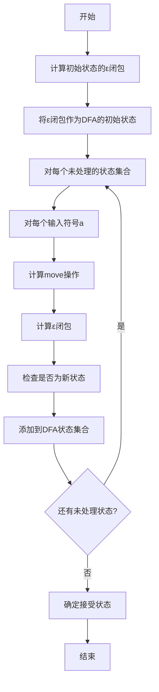
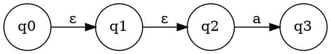
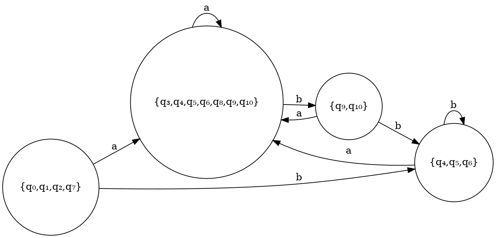

# 第三步：子集构造法

## 页面功能特色

在子集构造法步骤中，我们的平台提供了独特的算法可视化体验：

- **逐步构造过程**：实时展示从NFA到DFA的每一步转换过程，让您清楚看到每个DFA状态是如何从NFA状态集合构造出来的
- **状态映射可视化**：直观显示NFA状态集合与DFA状态之间的对应关系
- **转移表生成**：自动生成DFA的转移表，帮助理解状态转移逻辑
- **算法步骤追踪**：详细展示子集构造法的每个步骤，包括ε闭包计算、状态扩展等
- **交互式验证**：可以手动验证构造过程，加深对算法的理解

相比传统的静态教材，我们的子集构造法工具让抽象的算法变得具体可见，每一步都有清晰的视觉反馈。

## 输入限制

在子集构造法步骤中，系统会自动处理上一步生成的NFA，您需要：

- **确认NFA正确性**：确保上一步的NFA构造正确
- **理解算法参数**：了解ε闭包、状态扩展等概念
- **观察构造过程**：关注每个DFA状态的构造过程

**算法输入**：
- NFA状态集合
- 输入字母表
- 转移函数
- 初始状态和接受状态

## 知识背景

### 子集构造法的基本原理

子集构造法是将NFA转换为等价DFA的标准算法，其核心思想是：

**DFA的每个状态对应NFA的一个状态集合**

### 算法步骤

### 关键概念

#### 1. ε闭包（ε-Closure）

对于状态集合S，ε闭包ε-closure(S)定义为：
- 包含S中的所有状态
- 包含从S中任何状态通过ε转移可达的所有状态

#### 2. Move操作

对于状态集合S和输入符号a，move(S, a)定义为：
- 从S中任何状态通过输入a可达的所有状态的集合

#### 3. 状态扩展

对于DFA状态q（对应NFA状态集合S）和输入符号a：
1. 计算move(S, a)
2. 计算ε-closure(move(S, a))
3. 结果作为DFA中从q通过a转移到的状态

## 例题演示

让我们以NFA `(a|b)*ab` 为例，演示子集构造法：

### 步骤1：计算初始状态的ε闭包

**初始状态**：q₀
**ε闭包**：ε-closure({q₀}) = {q₀, q₁, q₂, q₇}

### 步骤2：构造DFA状态

**DFA状态0**：{q₀, q₁, q₂, q₇}

**对输入a的转移**：
- move({q₀, q₁, q₂, q₇}, a) = {q₃, q₈}
- ε-closure({q₃, q₈}) = {q₃, q₄, q₅, q₆, q₈, q₉, q₁₀}

**DFA状态1**：{q₃, q₄, q₅, q₆, q₈, q₉, q₁₀}

**对输入b的转移**：
- move({q₀, q₁, q₂, q₇}, b) = {q₄}
- ε-closure({q₄}) = {q₄, q₅, q₆}

**DFA状态2**：{q₄, q₅, q₆}

### 步骤3：继续构造其他状态

### 步骤4：确定接受状态

包含原NFA接受状态的DFA状态都是接受状态。

## 学习建议

1. **理解状态对应关系**：DFA的每个状态都对应NFA的一个状态集合，这是理解算法的关键

2. **掌握ε闭包计算**：ε闭包是子集构造法的基础，要熟练掌握其计算方法

3. **注意状态数量**：DFA的状态数量可能是指数级的，这是子集构造法的局限性

4. **验证构造结果**：使用测试字符串验证构造的DFA是否与原NFA等价

5. **观察算法步骤**：在可视化界面中，仔细观察每一步的构造过程

## 下一步

完成子集构造法后，您将进入**第四步：DFA可视化**，学习如何：

- 可视化DFA的状态图
- 理解DFA的确定性特性
- 分析DFA的状态转移逻辑
- 为后续的最小化做准备

准备好继续学习了吗？点击"下一步"开始DFA可视化的学习！ 