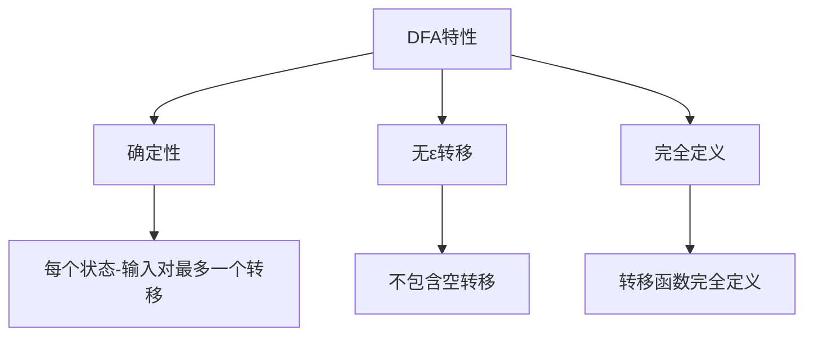
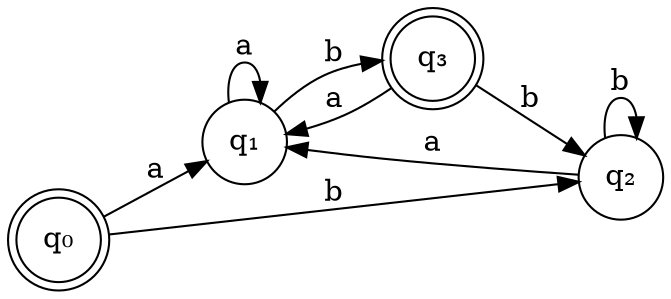
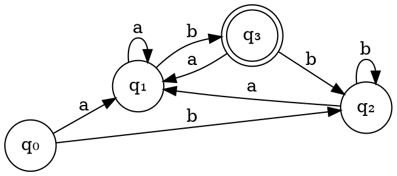

# 第四步：DFA可视化

## 页面功能特色

在DFA可视化步骤中，我们的平台提供了丰富的交互式可视化功能：

- **动态状态图**：实时显示DFA的状态转移图，支持缩放、平移等交互操作
- **状态信息展示**：点击状态节点可查看详细信息，包括状态标识、转移关系等
- **转移路径高亮**：输入测试字符串时，系统会高亮显示对应的转移路径
- **动画演示**：支持动画展示字符串识别过程，让您直观看到DFA如何工作
- **布局优化**：自动优化状态图布局，使图形清晰易读
- **导出功能**：支持将DFA图导出为图片格式，便于保存和分享

相比其他编译原理学习平台，我们的DFA可视化工具更加直观和交互式，让抽象的自动机理论变得具体可见。

## 输入限制

在DFA可视化步骤中，您可以：

- **查看DFA状态图**：系统自动显示上一步构造的DFA
- **输入测试字符串**：输入任意字符串测试DFA的识别能力
- **调整视图**：缩放、平移状态图以获得最佳观察效果
- **交互操作**：点击状态节点查看详细信息

**测试字符串要求**：
- 只能包含DFA字母表中的字符
- 长度不限
- 支持空字符串测试

## 知识背景

### DFA的形式定义

确定有限自动机（DFA）是一个五元组 M = (Q, Σ, δ, q₀, F)：

- **Q**：有限状态集合
- **Σ**：输入字母表
- **δ**：状态转移函数，δ: Q × Σ → Q
- **q₀**：初始状态
- **F**：接受状态集合

### DFA的确定性特性

DFA的确定性体现在：

1. **唯一转移**：对于每个状态和输入符号，最多只有一个转移
2. **无ε转移**：DFA不包含ε转移
3. **完全定义**：转移函数对每个状态-输入对都有定义

### 状态转移的可视化表示

## 例题演示

让我们以DFA `(a|b)*ab` 为例，演示DFA的可视化和测试过程：

### DFA状态图

### 测试字符串演示

**测试字符串1**：`aab`

<strong>识别过程：</strong> 
1. 初始状态：q₀ 
2. 输入'a'：q₀ → q₁ 
3. 输入'a'：q₁ → q₁ 
4. 输入'b'：q₁ → q₃ 
5. 最终状态：q₃（接受状态） 
<strong>结果：接受 ✓</strong>

**测试字符串2**：`abab`

<strong>识别过程：</strong> 
1. 初始状态：q₀ 
2. 输入'a'：q₀ → q₁ 
3. 输入'b'：q₁ → q₃ 
4. 输入'a'：q₃ → q₁ 
5. 输入'b'：q₁ → q₃ 
6. 最终状态：q₃（接受状态） 
<strong>结果：接受 ✓</strong>

**测试字符串3**：`ba`

<strong>识别过程：</strong> 
1. 初始状态：q₀ 
2. 输入'b'：q₀ → q₂ 
3. 输入'a'：q₂ → q₁ 
4. 最终状态：q₁（非接受状态） 
<strong>结果：拒绝 ✗</strong>

### 转移表表示

| 状态 | 输入a | 输入b |
|------|-------|-------|
| q₀   | q₁    | q₂    |
| q₁   | q₁    | q₃    |
| q₂   | q₁    | q₂    |
| q₃   | q₁    | q₂    |

## 学习建议

1. **理解确定性**：DFA的每个状态-输入对都有唯一的转移，这是与NFA的重要区别

2. **观察转移路径**：在可视化界面中，仔细观察字符串识别时的转移路径

3. **验证接受状态**：确保理解哪些状态是接受状态，哪些不是

4. **测试边界情况**：尝试测试空字符串、单个字符、长字符串等各种情况

5. **分析状态功能**：理解每个状态在识别过程中的作用

6. **比较与NFA**：思考DFA与NFA在可视化上的区别

## 下一步

完成DFA可视化后，您将进入**第五步：DFA最小化**，学习如何：

- 识别等价状态
- 合并等价状态
- 构造最小化DFA
- 理解最小化的意义和算法

准备好继续学习了吗？点击"下一步"开始DFA最小化的学习！ 