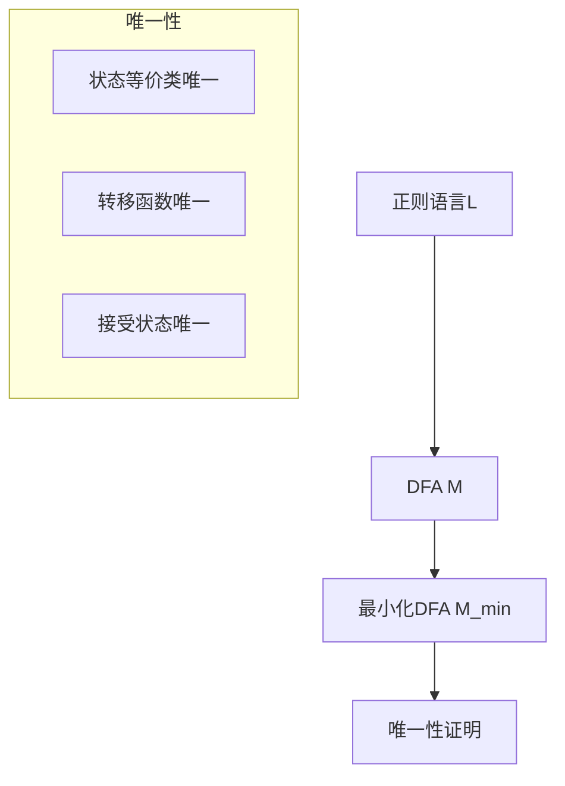
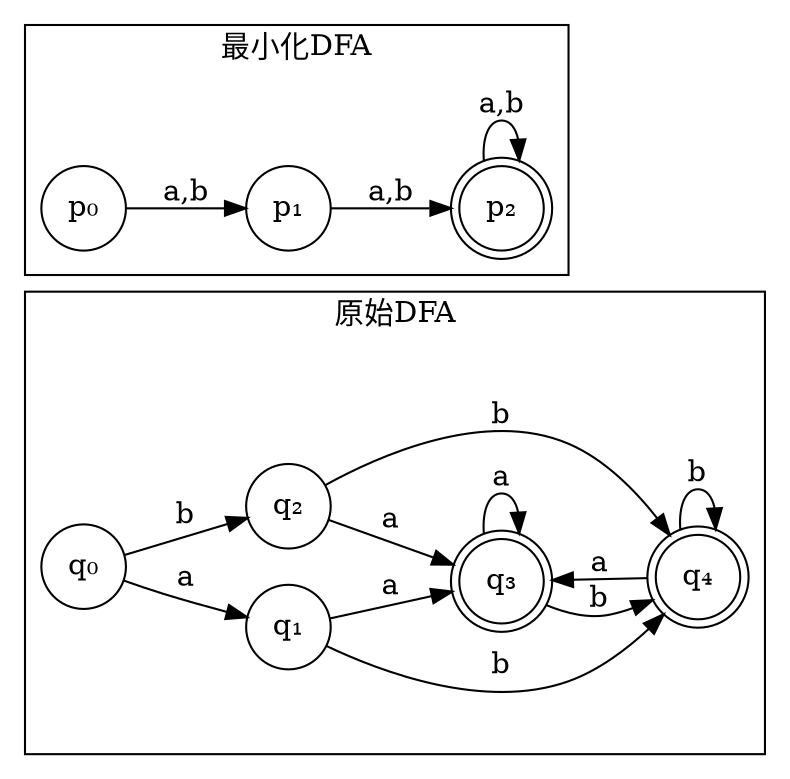
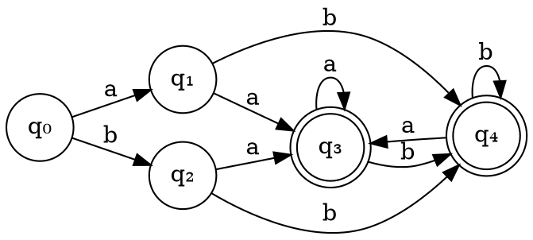
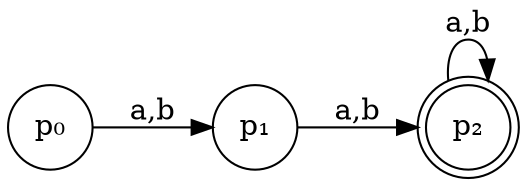

# 第六步：最小化DFA可视化

## 页面功能特色

在最小化DFA可视化步骤中，我们的平台提供了全面的对比和验证功能：

- **并排对比显示**：同时显示原始DFA和最小化DFA，便于直观比较
- **状态映射可视化**：清晰显示原始DFA状态与最小化DFA状态之间的对应关系
- **性能对比分析**：展示最小化前后的状态数量、转移数量等性能指标
- **等价性验证**：提供测试工具验证两个DFA是否接受相同的语言
- **动画演示**：通过动画展示最小化DFA如何识别字符串
- **导出功能**：支持将对比结果导出为图片或报告

相比其他编译原理学习平台，我们的最小化DFA可视化工具提供了最全面的对比分析功能，让您深入理解最小化的意义和效果。

## 输入限制

在最小化DFA可视化步骤中，您可以：

- **查看对比结果**：系统自动显示原始DFA和最小化DFA的对比
- **输入测试字符串**：输入任意字符串测试两个DFA的识别能力
- **验证等价性**：使用内置工具验证两个DFA是否等价
- **分析性能提升**：查看最小化带来的性能改进

**测试功能**：
- 支持批量测试字符串
- 自动生成测试用例
- 提供详细的测试报告

## 知识背景

### 最小化DFA的意义

最小化DFA具有以下重要意义：

1. **减少存储空间**：状态数量减少，转移表更紧凑
2. **提高执行效率**：状态转移更快，内存访问更少
3. **简化实现**：代码更简洁，维护更容易
4. **理论价值**：证明了DFA的唯一最小化形式

### 最小化DFA的唯一性

**Myhill-Nerode定理**：对于任何正则语言，存在唯一的（在同构意义下）最小化DFA。

### 等价性验证

两个DFA等价当且仅当：
- 它们接受相同的语言
- 对于任何输入字符串，要么都接受，要么都拒绝

## 例题演示

让我们以完整的例子演示最小化DFA的可视化和验证过程：

### 原始DFA vs 最小化DFA

**原始DFA**：

**最小化DFA**：

### 状态映射关系

<strong>状态映射：</strong> 
p₀ = {q₀} 
p₁ = {q₁, q₂} 
p₂ = {q₃, q₄}

### 性能对比

<strong>性能对比：</strong> 
<table style="width: 100%; border-collapse: collapse;">
<tr style="background: #f1f3f4;">
<th style="border: 1px solid #ddd; padding: 8px;">指标</th>
<th style="border: 1px solid #ddd; padding: 8px;">原始DFA</th>
<th style="border: 1px solid #ddd; padding: 8px;">最小化DFA</th>
<th style="border: 1px solid #ddd; padding: 8px;">改进</th>
</tr>
<tr>
<td style="border: 1px solid #ddd; padding: 8px;">状态数量</td>
<td style="border: 1px solid #ddd; padding: 8px;">5</td>
<td style="border: 1px solid #ddd; padding: 8px;">3</td>
<td style="border: 1px solid #ddd; padding: 8px;">-40%</td>
</tr>
<tr>
<td style="border: 1px solid #ddd; padding: 8px;">转移数量</td>
<td style="border: 1px solid #ddd; padding: 8px;">10</td>
<td style="border: 1px solid #ddd; padding: 8px;">6</td>
<td style="border: 1px solid #ddd; padding: 8px;">-40%</td>
</tr>
<tr>
<td style="border: 1px solid #ddd; padding: 8px;">存储空间</td>
<td style="border: 1px solid #ddd; padding: 8px;">25个条目</td>
<td style="border: 1px solid #ddd; padding: 8px;">9个条目</td>
<td style="border: 1px solid #ddd; padding: 8px;">-64%</td>
</tr>
</table>

### 等价性验证

**测试字符串验证**：

<strong>测试结果：</strong> 
<table style="width: 100%; border-collapse: collapse;">
<tr style="background: #f1f3f4;">
<th style="border: 1px solid #ddd; padding: 8px;">测试字符串</th>
<th style="border: 1px solid #ddd; padding: 8px;">原始DFA</th>
<th style="border: 1px solid #ddd; padding: 8px;">最小化DFA</th>
<th style="border: 1px solid #ddd; padding: 8px;">结果</th>
</tr>
<tr>
<td style="border: 1px solid #ddd; padding: 8px;">ε</td>
<td style="border: 1px solid #ddd; padding: 8px;">拒绝</td>
<td style="border: 1px solid #ddd; padding: 8px;">拒绝</td>
<td style="border: 1px solid #ddd; padding: 8px;">✓</td>
</tr>
<tr>
<td style="border: 1px solid #ddd; padding: 8px;">a</td>
<td style="border: 1px solid #ddd; padding: 8px;">拒绝</td>
<td style="border: 1px solid #ddd; padding: 8px;">拒绝</td>
<td style="border: 1px solid #ddd; padding: 8px;">✓</td>
</tr>
<tr>
<td style="border: 1px solid #ddd; padding: 8px;">ab</td>
<td style="border: 1px solid #ddd; padding: 8px;">接受</td>
<td style="border: 1px solid #ddd; padding: 8px;">接受</td>
<td style="border: 1px solid #ddd; padding: 8px;">✓</td>
</tr>
<tr>
<td style="border: 1px solid #ddd; padding: 8px;">aab</td>
<td style="border: 1px solid #ddd; padding: 8px;">接受</td>
<td style="border: 1px solid #ddd; padding: 8px;">接受</td>
<td style="border: 1px solid #ddd; padding: 8px;">✓</td>
</tr>
<tr>
<td style="border: 1px solid #ddd; padding: 8px;">ba</td>
<td style="border: 1px solid #ddd; padding: 8px;">拒绝</td>
<td style="border: 1px solid #ddd; padding: 8px;">拒绝</td>
<td style="border: 1px solid #ddd; padding: 8px;">✓</td>
</tr>
</table>
<strong>结论：两个DFA完全等价 ✓</strong>

## 学习建议

1. **理解最小化的意义**：最小化不仅减少了状态数量，更重要的是提高了效率

2. **掌握等价性验证**：学会如何验证两个DFA是否等价

3. **分析性能提升**：理解最小化带来的具体性能改进

4. **观察状态映射**：理解原始状态如何映射到最小化状态

5. **比较不同算法**：了解不同最小化算法的效果差异

6. **应用实际场景**：思考最小化在实际编译器中的应用

## 下一步

恭喜您完成了FA模块的所有学习步骤！现在您已经掌握了：

- 正则表达式的输入和验证
- NFA的构造过程
- 子集构造法
- DFA的可视化
- DFA的最小化
- 最小化DFA的验证

接下来您可以：

1. **进入LL1模块**：学习自上而下的语法分析
2. **进入LR0模块**：学习自下而上的语法分析
3. **进入SLR1模块**：学习改进的LR分析
4. **使用AI助手**：获得个性化的学习指导

准备好继续您的编译原理学习之旅了吗？ 