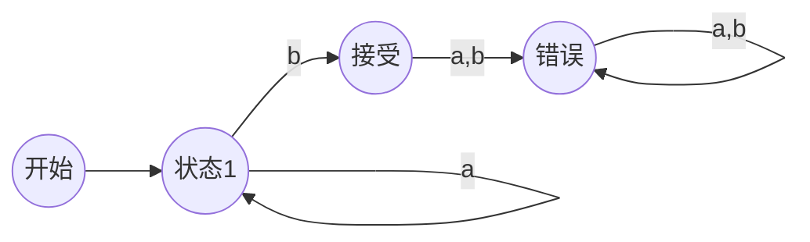

# 快速开始

欢迎使用编译原理可视化工具！本工具旨在帮助您深入理解编译原理的核心概念和算法。

## 什么是编译原理？

编译原理是计算机科学中的一个重要分支，主要研究如何将高级编程语言转换为机器语言的过程。它包括以下几个主要阶段：

1. **词法分析** - 将源代码分解为词法单元（Token）
2. **语法分析** - 根据语法规则构建抽象语法树
3. **语义分析** - 检查程序的语义正确性
4. **中间代码生成** - 生成中间表示
5. **代码优化** - 优化生成的代码
6. **目标代码生成** - 生成最终的机器代码

## 本工具的特色功能

### 🎯 交互式学习
- 逐步展示算法执行过程
- 可视化展示中间结果
- 支持用户交互操作

### 📊 丰富的可视化
- 有限自动机状态图
- 语法分析树
- 分析表可视化
- 实时动画效果

### 🔧 实用工具
- 正则表达式测试
- 文法输入验证
- 字符串分析演示

## 开始使用

### 1. 选择学习模块

在主页上，您可以看到四个主要的学习模块：

- **有限自动机 (FA)** - 学习正则表达式到DFA的转换
- **LL1 分析** - 自顶向下语法分析
- **LR0 分析** - 自底向上语法分析
- **SLR1 分析** - 改进的LR分析

### 2. 跟随步骤学习

每个模块都分为多个步骤，按照逻辑顺序排列：

1. 输入数据（正则表达式、文法等）
2. 查看转换过程
3. 观察可视化结果
4. 进行字符串分析

### 3. 理解核心概念

通过可视化的方式，您可以：

- 观察状态转换过程
- 理解First集和Follow集的计算
- 掌握项目集构造方法
- 学会分析表的构建和使用

## 示例：有限自动机

让我们通过一个简单的例子来了解有限自动机：

### 正则表达式：`a*b`

这个正则表达式表示：零个或多个 `a` 后跟一个 `b`。

### 状态转换表

| 状态 | 输入a | 输入b |
|------|-------|-------|
| 开始 | 状态1 | 错误  |
| 状态1 | 状态1 | 接受  |
| 接受 | 错误  | 错误  |
| 错误 | 错误  | 错误  |

## 下一步

现在您已经了解了基本概念，建议您：

1. 从**有限自动机**模块开始学习
2. 尝试不同的输入数据
3. 观察每个步骤的详细过程
4. 阅读相关的理论文档

祝您学习愉快！如果在使用过程中遇到问题，请随时查看帮助文档或联系技术支持。 