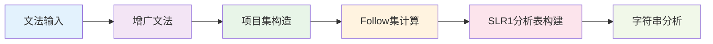
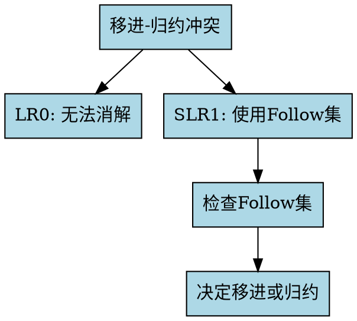

# SLR1语法分析模块概述

SLR1语法分析是LR0分析的改进版本，通过使用Follow集来解决LR0分析中的移进-归约冲突。通过本模块的学习，您将掌握如何构建SLR1分析表，并理解它与LR0分析的区别。

## 🎯 模块特色

### 交互式学习体验
与传统的静态教材不同，我们的SLR1模块提供：

- **逐步可视化**：每个构造步骤都有详细的可视化展示
- **实时交互**：您可以亲自参与项目集构造和分析表构建
- **即时验证**：系统会实时验证您的操作是否正确
- **智能提示**：提供详细的构造提示和错误分析

### 完整的分析流程
我们涵盖了SLR1分析的完整过程：

### 智能AI助手
- **上下文感知**：AI能够理解您当前的学习步骤
- **图表生成**：AI可以生成Mermaid和Graphviz图表来解释概念
- **个性化指导**：根据您的学习进度提供针对性建议

## 📚 学习步骤

### 第一步：文法输入
- **功能**：输入和验证SLR1文法
- **特色**：严格的文法格式验证，实时错误提示
- **学习目标**：理解SLR1文法的特点和限制

### 第二步：增广文法
- **功能**：为文法添加增广产生式
- **特色**：可视化展示增广过程
- **学习目标**：理解增广文法的构造方法

### 第三步：项目集构造
- **功能**：构造LR0项目集规范族
- **特色**：交互式项目集构造，可视化状态转换
- **学习目标**：掌握LR0项目集的构造算法

### 第四步：SLR1分析表构建
- **功能**：基于项目集和Follow集构造SLR1分析表
- **特色**：表格填写，冲突消解，规则应用
- **学习目标**：理解SLR1分析表的构建原理

### 第五步：字符串分析
- **功能**：使用SLR1分析表分析输入字符串
- **特色**：栈操作可视化，分析过程动画
- **学习目标**：掌握SLR1分析的实际应用

## 🔧 技术特色

### 先进的冲突消解技术
- **Follow集应用**：使用Follow集来消解移进-归约冲突
- **冲突检测**：自动检测和标识冲突
- **消解策略**：智能的冲突消解策略
- **可视化展示**：清晰展示冲突消解过程

### 可视化技术
- **项目集图**：可视化展示项目集规范族
- **Follow集计算**：可视化展示Follow集的计算过程
- **栈操作动画**：可视化展示分析栈的操作
- **状态转换**：清晰显示分析过程中的状态变化

### 智能验证系统
- **多级验证**：语法验证、语义验证、逻辑验证
- **详细反馈**：提供具体的错误信息和修正建议
- **学习指导**：根据错误类型提供学习建议

## 💡 学习建议

### 学习顺序
1. **从文法开始**：先理解SLR1文法的概念和特点
2. **掌握增广**：理解增广文法的构造方法
3. **学习项目集**：掌握LR0项目集的构造算法
4. **理解Follow集**：掌握Follow集在SLR1中的作用
5. **构建分析表**：学会如何构建SLR1分析表
6. **实践分析**：使用分析表进行字符串分析

### 学习方法
- **理解原理**：不要死记硬背，要理解每个步骤的原理
- **动手实践**：每个步骤都要亲自操作和验证
- **对比学习**：与LR0分析进行对比，理解改进之处
- **及时提问**：遇到问题立即使用AI助手

### 常见误区
- **忽视Follow集**：忘记Follow集在SLR1中的重要作用
- **混淆LR0和SLR1**：不清楚两者的区别和联系
- **不检查冲突**：没有检查移进-归约冲突
- **死记硬背**：不理解原理，只记忆步骤

## 🎯 学习目标

通过本模块的学习，您将能够：

1. **理解SLR1分析**：掌握SLR1分析的基本原理
2. **构造增广文法**：能够为任意文法构造增广文法
3. **构造项目集**：能够构造LR0项目集规范族
4. **计算Follow集**：能够计算文法的Follow集
5. **构建分析表**：能够构建SLR1分析表
6. **分析字符串**：能够使用分析表分析输入字符串
7. **消解冲突**：能够识别和消解移进-归约冲突

## 🔍 SLR1 vs LR0

### 主要区别

  

    <h4 style="color: #1e40af; margin: 0 0 0.5rem 0;">LR0分析</h4>
    <ul style="margin: 0; color: #374151;">
      <li>只使用项目集信息</li>
      <li>容易出现移进-归约冲突</li>
      <li>分析能力相对较弱</li>
      <li>实现相对简单</li>
    </ul>
  

  

    <h4 style="color: #047857; margin: 0 0 0.5rem 0;">SLR1分析</h4>
    <ul style="margin: 0; color: #374151;">
      <li>使用项目集和Follow集</li>
      <li>能够消解部分冲突</li>
      <li>分析能力更强</li>
      <li>实现相对复杂</li>
    </ul>
  

### 冲突消解原理

## 📚 下一步

现在您已经了解了SLR1模块的整体结构，建议您：

1. **开始第一步**：从文法输入开始学习
2. **充分利用AI助手**：在学习过程中随时获取帮助
3. **实践操作**：亲自动手完成每个步骤
4. **深入理解**：思考每个步骤背后的原理
5. **对比学习**：与LR0分析进行对比，理解改进之处

记住，SLR1分析是LR0分析的改进版本，通过使用Follow集来解决冲突，使得分析能力更强。掌握好这部分内容将为后续的LR1、LALR等更高级的分析方法打下坚实的基础！

准备好开始您的SLR1学习之旅了吗？点击"第一步：文法输入"开始吧！ 