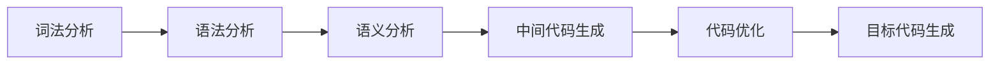
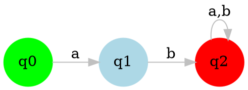

# AI聊天组件使用指南

## 概述

AI聊天组件是一个通用的智能问答系统，集成了DeepSeek大模型，可以为用户提供编译原理相关的教学帮助。

## 功能特性

- 🤖 集成DeepSeek大模型API
- 💬 实时流式输出
- 📱 响应式设计，支持移动端
- 🎯 根据页面内容提供针对性帮助
- 📊 自动收集用户输入和后端数据
- 🎨 美观的UI界面
- ⌨️ 键盘快捷键支持
- 📈 支持Mermaid和Graphviz图表渲染

## 组件结构

```
src/components/ai/
├── index.ts                 # 组件导出
├── types.ts                 # 类型定义
├── AIChatWidget.vue         # 主聊天组件（展开/收起）
├── AIChatWindow.vue         # 聊天窗口组件
├── composables/
│   ├── useAIChat.ts         # AI聊天逻辑
│   └── useAIGlobal.ts       # 全局状态管理
└── README.md               # 使用说明
```

## 快速开始

### 1. 在页面中引入组件

```vue
<template>
  <div class="your-page">
    <!-- 页面内容 -->
    
    <!-- AI聊天组件 -->
    <AIChatWidget
      page-type="fa"
      :context="chatContext"
    />
  </div>
</template>

<script setup lang="ts">
import { ref, onMounted } from 'vue'
import { AIChatWidget, useAIGlobal } from '@/components/ai'
import type { ChatContext } from '@/components/ai/types'

// 使用全局AI状态管理
const { updatePageInfo, updateUserInput, updateBackendData, updateUserAnswers, getCurrentContext } = useAIGlobal()

// 聊天上下文
const chatContext = ref<ChatContext>({
  currentPage: 'fa',
  userInput: {},
  backendData: {},
  userAnswers: {},
  pageContext: '有限自动机学习页面'
})

// 组件挂载时初始化
onMounted(() => {
  updatePageInfo('fa', '有限自动机学习页面')
  chatContext.value = getCurrentContext()
})
</script>
```

### 2. 更新聊天上下文

当用户输入数据、后端返回数据或用户答题时，更新聊天上下文：

```typescript
// 更新用户输入
updateUserInput({
  regex: 'a*b',
  step: 1
})

// 更新后端数据
updateBackendData({
  nfa: { states: ['q0', 'q1'], transitions: [] },
  dfa: { states: ['A', 'B'], transitions: [] }
})

// 更新用户答题记录
updateUserAnswers({
  step1: { correct: true, score: 100 },
  step2: { correct: false, score: 80 }
})

// 更新聊天上下文
chatContext.value = getCurrentContext()
```

## API参考

### AIChatWidget Props

| 属性 | 类型 | 必填 | 说明 |
|------|------|------|------|
| pageType | string | 是 | 页面类型（fa/ll1/lr0/slr1） |
| context | ChatContext | 是 | 聊天上下文数据 |

### ChatContext 类型

```typescript
interface ChatContext {
  currentPage: string        // 当前页面
  userInput?: Record<string, any>    // 用户输入数据
  backendData?: Record<string, any>  // 后端返回数据
  userAnswers?: Record<string, any>  // 用户答题记录
  pageContext?: string       // 页面内容描述
}
```

### useAIGlobal 方法

| 方法 | 参数 | 说明 |
|------|------|------|
| updatePageInfo | (pageType: string, pageContext?: string) | 更新页面信息 |
| updateUserInput | (input: Record<string, any>) | 更新用户输入数据 |
| updateBackendData | (data: Record<string, any>) | 更新后端数据 |
| updateUserAnswers | (answers: Record<string, any>) | 更新用户答题记录 |
| getCurrentContext | () => ChatContext | 获取当前聊天上下文 |
| clearChatContext | () | 清空聊天上下文 |

## 键盘快捷键

- `Ctrl/Cmd + Shift + A`: 切换聊天窗口
- `ESC`: 关闭聊天窗口
- `Enter`: 发送消息
- `Ctrl + Enter`: 换行

## 预设问题

每个页面类型都有相应的预设问题：

### FA (有限自动机)
- 这个正则表达式是什么意思？
- NFA和DFA有什么区别？
- 为什么要进行DFA最小化？
- 子集构造法的步骤是什么？

### LL1 (语法分析)
- 什么是First集和Follow集？
- 如何判断一个文法是否是LL1文法？
- LL1分析表的构建过程是什么？
- 为什么会出现冲突？

### LR0 (语法分析)
- LR0分析的基本思想是什么？
- 项目集规范族是如何构造的？
- LR0分析表的构建过程是什么？
- 什么是移进-归约冲突？

### SLR1 (语法分析)
- SLR1和LR0有什么区别？
- SLR1如何解决LR0的冲突问题？
- SLR1分析表的构建过程是什么？
- 什么时候使用SLR1分析？

## 样式定制

AI组件使用Tailwind CSS，可以通过以下方式定制样式：

```vue
<style scoped>
/* 自定义聊天窗口样式 */
.ai-chat-window {
  /* 你的样式 */
}

/* 自定义按钮样式 */
.ai-chat-widget button {
  /* 你的样式 */
}
</style>
```

## 图表渲染功能

AI聊天组件现在支持图表渲染功能，AI可以主动使用图表来帮助用户理解复杂概念：

### 支持的图表类型

#### Mermaid图表
- **流程图**: 展示算法流程、决策过程
- **时序图**: 展示交互时序、消息传递
- **甘特图**: 展示项目进度、时间安排
- **类图**: 展示类关系、对象结构
- **状态图**: 展示状态转换、状态机
- **饼图**: 展示数据分布、比例关系
- **用户旅程图**: 展示用户体验流程
- **Git图**: 展示版本控制分支

#### Graphviz DOT图表
- **有向图**: 展示依赖关系、数据流
- **无向图**: 展示连接关系、网络拓扑
- **状态图**: 展示状态转换、自动机
- **网络拓扑图**: 展示网络结构、节点关系
- **数据库ER图**: 展示实体关系、数据模型
- **UML图**: 展示软件架构、类关系

### 图表选择策略

AI会根据内容类型智能选择图表：

#### 使用Mermaid的情况
- **流程图**：算法流程、决策过程
- **时序图**：交互时序、消息传递
- **甘特图**：项目进度、时间安排

#### 使用Graphviz DOT的情况
- **自动机图**：DFA、NFA、PDA等（Graphviz布局算法特别适合）
- **语法树**：抽象语法树、语法分析树
- **网络拓扑图**：计算机网络、系统架构

### 使用示例

#### Mermaid示例 - 编译流程


#### Graphviz DOT示例 - DFA自动机


## 注意事项

1. **API密钥**: 组件中已配置DeepSeek API密钥，请确保密钥有效
2. **网络请求**: 组件直接在前端调用API，需要确保网络连接正常
3. **数据隐私**: 用户输入的数据会发送给AI模型，请注意隐私保护
4. **性能优化**: 大量数据时建议分批更新聊天上下文
5. **图表渲染**: 图表会自动渲染，支持图片/代码视图切换、下载和全屏查看

## 故障排除

### 常见问题

1. **API调用失败**
   - 检查网络连接
   - 验证API密钥是否正确
   - 查看浏览器控制台错误信息

2. **组件不显示**
   - 检查组件是否正确导入
   - 验证props是否正确传递
   - 确认没有CSS冲突

3. **流式输出不工作**
   - 检查浏览器是否支持流式API
   - 验证API响应格式是否正确

### 调试模式

在开发环境中，可以启用调试模式：

```typescript
// 在浏览器控制台中查看详细日志
console.log('AI聊天上下文:', chatContext.value)
console.log('AI配置:', aiConfig)
```

## 更新日志

### v1.1.0
- 新增Mermaid和Graphviz图表渲染功能
- AI可以主动使用图表展示复杂概念
- 支持图表图片/代码视图切换
- 支持图表下载和全屏查看
- 优化图表样式和交互体验

### v1.0.0
- 初始版本发布
- 支持基本的AI聊天功能
- 集成DeepSeek API
- 实现流式输出
- 添加预设问题功能 