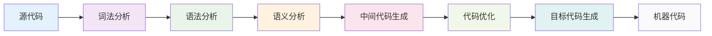
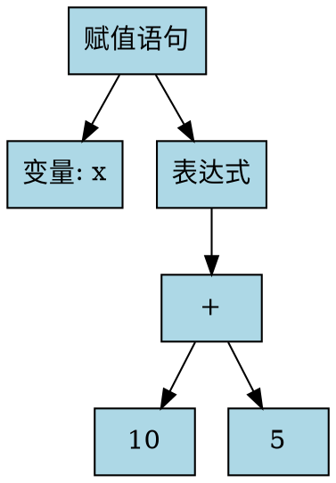
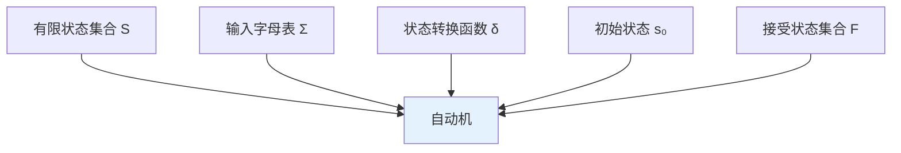

# 基础概念

在开始学习编译原理的具体算法之前，让我们先了解一些核心概念。这些概念将贯穿整个编译过程，是理解后续内容的基础。

## 🔍 什么是编译原理？

编译原理是计算机科学中的一个重要分支，主要研究如何将高级编程语言转换为机器语言的过程。这个过程通常包括以下几个主要阶段：



## 📝 核心概念详解

### 1. 词法分析 (Lexical Analysis)

**定义**：将源代码分解为词法单元（Token）的过程。

**作用**：
- 识别关键字、标识符、常量、运算符等
- 去除空白字符和注释
- 生成词法单元序列

**示例**：
```c
// 源代码
int x = 10 + 5;

// 词法分析后的Token序列
[KEYWORD: int] [IDENTIFIER: x] [OPERATOR: =] [NUMBER: 10] [OPERATOR: +] [NUMBER: 5] [SEMICOLON: ;]
```

### 2. 语法分析 (Syntax Analysis)

**定义**：根据语法规则构建抽象语法树（AST）的过程。

**作用**：
- 检查程序的语法正确性
- 构建语法树结构
- 为语义分析做准备

**示例**：


### 3. 语义分析 (Semantic Analysis)

**定义**：检查程序的语义正确性，进行类型检查等。

**作用**：
- 类型检查
- 作用域分析
- 语义错误检测

## 🔗 有限自动机 (Finite Automata)

有限自动机是编译原理中的基础概念，用于描述和识别正则语言。

### 基本组成

有限自动机由以下五个部分组成：



### 类型

#### 确定有限自动机 (DFA)
- 每个状态对每个输入符号都有唯一的下一状态
- 没有ε转换
- 更容易实现

#### 非确定有限自动机 (NFA)
- 一个状态对某个输入符号可能有多个下一状态
- 允许ε转换
- 更灵活，但实现复杂

**示例对比**：

<div style="display: grid; grid-template-columns: 1fr 1fr; gap: 2rem; margin: 1.5rem 0;">
  <div>
    <h4>DFA示例</h4>
    <div style="border: 2px solid #3b82f6; border-radius: 8px; padding: 1rem; background: #f0f9ff;">
      <p><strong>特点：</strong></p>
      <ul>
        <li>每个状态对每个输入都有唯一转换</li>
        <li>确定性更强</li>
        <li>实现简单</li>
      </ul>
    </div>
  </div>
  <div>
    <h4>NFA示例</h4>
    <div style="border: 2px solid #10b981; border-radius: 8px; padding: 1rem; background: #f0fdf4;">
      <p><strong>特点：</strong></p>
      <ul>
        <li>一个状态可能有多个转换</li>
        <li>更灵活的表达能力</li>
        <li>允许ε转换</li>
      </ul>
    </div>
  </div>
</div>

## 📚 语法分析 (Parsing)

语法分析是编译过程中的关键步骤，主要分为两大类：

### 自顶向下分析 (Top-Down Parsing)

**特点**：
- 从开始符号开始推导
- 预测下一个输入符号
- 构建语法树

**常见算法**：
- LL(1)分析
- 递归下降分析

### 自底向上分析 (Bottom-Up Parsing)

**特点**：
- 从输入符号开始归约
- 使用产生式进行归约
- 构建语法树

**常见算法**：
- LR(0)分析
- SLR(1)分析
- LR(1)分析

## 🎯 正则表达式

正则表达式是描述正则语言的简洁表示方法。

### 基本操作

```mermaid
graph LR
    A[连接 ab] --> D[正则表达式]
    B[选择 a|b] --> D
    C[闭包 a*] --> D
    
    style D fill:#e3f2fd
```

### 运算符优先级

1. **闭包 (*)**：最高优先级
2. **连接 (·)**：中等优先级
3. **选择 (|)**：最低优先级

**示例**：
```
(a|b)*abb
```
这个正则表达式表示：零个或多个a或b，后跟abb。

## 🔧 上下文无关文法 (CFG)

上下文无关文法是描述编程语言语法的重要工具。

### 基本概念

**产生式**：A → α
- A：非终结符
- α：终结符和非终结符的序列

**示例文法**：
```
S → aSb | ε
```

这个文法生成的语言是：{ε, ab, aabb, aaabbb, ...}

### 文法的分类

根据产生式的形式，文法可以分为：

1. **0型文法**：无限制文法
2. **1型文法**：上下文相关文法
3. **2型文法**：上下文无关文法
4. **3型文法**：正则文法

## 💡 学习建议

### 理解层次

1. **概念理解**：先理解每个概念的基本含义
2. **形式化定义**：掌握数学定义和符号
3. **实际应用**：通过例子理解应用场景
4. **算法实现**：学习具体的算法步骤

### 学习方法

- **可视化学习**：利用我们的可视化工具理解抽象概念
- **动手实践**：亲自操作每个步骤
- **对比学习**：比较不同概念和算法的异同
- **循序渐进**：从简单概念开始，逐步深入

## 📚 下一步

现在您已经了解了编译原理的基础概念，建议您：

1. **开始有限自动机模块**：从最基础的概念开始学习
2. **实践操作**：使用我们的可视化工具进行练习
3. **深入理解**：结合理论知识和实际操作
4. **利用AI助手**：遇到问题时及时获取帮助

记住，编译原理是一个需要大量练习的学科。通过我们的可视化平台，您可以更直观地理解这些抽象概念，让学习变得更加高效和有趣！ 