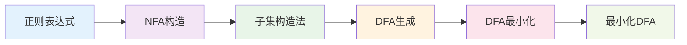

# 有限自动机 (FA) 模块概述

有限自动机是编译原理中的基础概念，也是词法分析器的理论基础。通过本模块的学习，您将掌握从正则表达式到确定有限自动机的完整转换过程。

## 🎯 模块特色

### 交互式学习体验
与传统的静态教材不同，我们的FA模块提供：

- **逐步可视化**：每个转换步骤都有详细的可视化展示
- **实时交互**：您可以在画布上亲自绘制自动机
- **即时验证**：系统会实时验证您的操作是否正确
- **答案对比**：可以查看标准答案与您的答案进行对比

### 完整的转换流程
我们涵盖了从正则表达式到最小化DFA的完整过程：

### 智能AI助手
- **上下文感知**：AI能够理解您当前的学习步骤
- **图表生成**：AI可以生成Mermaid和Graphviz图表来解释概念
- **个性化指导**：根据您的学习进度提供针对性建议

## 📚 学习步骤

### 第一步：正则表达式输入
- **功能**：输入和验证正则表达式
- **特色**：提供常用示例，实时验证
- **学习目标**：理解正则表达式的语法和语义

### 第二步：NFA构造
- **功能**：使用Thompson构造法将正则表达式转换为NFA
- **特色**：交互式画布，可视化构造过程
- **学习目标**：掌握Thompson构造法的原理和步骤

### 第三步：子集构造法
- **功能**：将NFA转换为DFA
- **特色**：表格填写，进度跟踪
- **学习目标**：理解子集构造法的核心思想

### 第四步：DFA可视化
- **功能**：可视化展示构造的DFA
- **特色**：交互式图形，状态转换动画
- **学习目标**：理解DFA的结构和转换关系

### 第五步：DFA最小化
- **功能**：对DFA进行最小化处理
- **特色**：等价类划分可视化
- **学习目标**：掌握DFA最小化算法

### 第六步：最小化DFA可视化
- **功能**：展示最小化后的DFA
- **特色**：性能对比，优化效果展示
- **学习目标**：理解最小化的实际效果

## 🔧 技术特色

### 先进的图形技术
- **Vue Flow**：专业的图形可视化库
- **SVG渲染**：高质量的矢量图形
- **动画效果**：流畅的状态转换动画

### 智能验证系统
- **实时验证**：输入时即时检查正确性
- **错误提示**：详细的错误信息和修正建议
- **进度跟踪**：清晰的学习进度指示

### 响应式设计
- **多设备支持**：桌面端和移动端自适应
- **主题切换**：支持明暗主题
- **交互优化**：触摸友好的操作界面

## 💡 学习建议

### 学习顺序
1. **从基础开始**：先理解正则表达式的基本概念
2. **逐步深入**：按照步骤顺序学习，不要跳步
3. **动手实践**：每个步骤都要亲自操作
4. **理解原理**：思考每个步骤背后的理论依据

### 学习方法
- **观察变化**：注意每个操作对图形的影响
- **对比分析**：比较不同步骤的结果
- **及时提问**：遇到问题立即使用AI助手
- **反复练习**：多尝试不同的输入数据

### 常见误区
- **急于求成**：不要跳过基础步骤
- **只看不做**：一定要动手操作
- **忽视细节**：注意每个转换的细节
- **不思考原理**：理解比记忆更重要

## 🎯 学习目标

通过本模块的学习，您将能够：

1. **理解正则表达式**：掌握正则表达式的语法和语义
2. **掌握Thompson构造法**：能够将正则表达式转换为NFA
3. **理解子集构造法**：掌握NFA到DFA的转换原理
4. **学会DFA最小化**：掌握DFA最小化算法
5. **应用理论知识**：能够解决实际问题

## 📚 下一步

现在您已经了解了FA模块的整体结构，建议您：

1. **开始第一步**：从正则表达式输入开始学习
2. **充分利用AI助手**：在学习过程中随时获取帮助
3. **实践操作**：亲自动手完成每个步骤
4. **深入理解**：思考每个步骤背后的原理

记住，有限自动机是编译原理的基础，掌握好这部分内容将为后续的语法分析学习打下坚实的基础！

准备好开始您的FA学习之旅了吗？点击"第一步：正则表达式输入"开始吧！ 