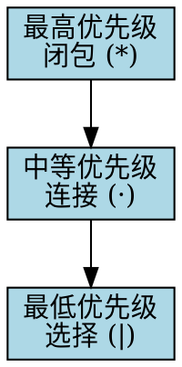

# 第一步：正则表达式输入

欢迎来到有限自动机学习的第一步！在这一步中，您将学习如何输入和验证正则表达式，这是构建有限自动机的基础。

## 🎯 页面功能特色

### 与市面上其他网站的对比优势

**传统学习方式的问题**：
- 静态教材，缺乏交互性
- 无法实时验证输入
- 错误提示不够详细
- 学习过程枯燥乏味

**我们的解决方案**：
- **实时验证**：输入时即时检查正则表达式的正确性
- **智能提示**：提供详细的错误信息和修正建议
- **快速示例**：内置常用正则表达式模板，一键使用
- **交互式学习**：让学习过程变得生动有趣

### 您能学到什么

通过这一步的学习，您将：
- 掌握正则表达式的基本语法
- 理解运算符的优先级规则
- 学会如何构造有效的正则表达式
- 为后续的自动机构造打下基础

## 📝 输入限制与规则

### 支持的字符和操作

**基本字符**：
- 小写字母：`a-z`
- 数字：`0-9`
- 特殊符号：`(`, `)`, `|`, `*`, `+`, `?`

**基本操作**：
- **连接**：`ab` 表示字符a后跟字符b
- **选择**：`a|b` 表示字符a或字符b
- **闭包**：`a*` 表示零个或多个字符a
- **正闭包**：`a+` 表示一个或多个字符a
- **可选**：`a?` 表示零个或一个字符a

### 输入规则

<div style="border: 2px solid #3b82f6; border-radius: 8px; padding: 1rem; background: #f0f9ff; margin: 1rem 0;">
  <h4 style="color: #1e40af; margin: 0 0 0.5rem 0;">⚠️ 重要规则</h4>
  <ul style="margin: 0; color: #374151;">
    <li>只能使用小写字母和数字作为基本字符</li>
    <li>括号必须成对出现</li>
    <li>运算符优先级：闭包 > 连接 > 选择</li>
    <li>不支持中文字符和特殊符号</li>
    <li>不能有语法错误</li>
  </ul>
</div>

### 常见错误示例

| 错误输入 | 错误原因 | 正确写法 |
|---------|---------|---------|
| `A*` | 大写字母不支持 | `a*` |
| `(a|b` | 括号不匹配 | `(a|b)` |
| `a**` | 重复闭包 | `a*` |
| `a|b|c` | 多重选择 | `a|b|c` |

## 🧠 背后的知识与规则

### 正则表达式的形式化定义

正则表达式是描述正则语言的数学工具，具有以下递归定义：

```mermaid
graph TD
    A[正则表达式] --> B[基本字符]
    A --> C[空串 ε]
    A --> D[连接 r₁r₂]
    A --> E[选择 r₁|r₂]
    A --> F[闭包 r*]
    
    style A fill:#e3f2fd
    style B fill:#f3e5f5
    style C fill:#e8f5e8
    style D fill:#fff3e0
    style E fill:#fce4ec
    style F fill:#f1f8e9
```

### 运算符优先级



### 正则表达式的语义

**基本语义**：
- `ε`：空串
- `a`：单个字符a
- `r₁r₂`：r₁后跟r₂的连接
- `r₁|r₂`：r₁或r₂的选择
- `r*`：r的零次或多次重复

**示例语言**：
```
(a|b)*abb
```
这个正则表达式描述的语言是：所有以"abb"结尾的由a和b组成的字符串。

## 📖 例题演示

### 例题1：基本操作

**题目**：构造一个正则表达式，描述所有由a和b组成的字符串。

**解答过程**：

1. **分析需求**：需要描述所有可能的a和b组合
2. **选择操作**：使用选择操作`|`表示a或b
3. **重复操作**：使用闭包操作`*`表示零次或多次重复
4. **构造表达式**：`(a|b)*`

**验证**：
- 空串：ε ∈ L((a|b)*) ✓
- 单个字符：a, b ∈ L((a|b)*) ✓
- 多个字符：ab, ba, aab, bba ∈ L((a|b)*) ✓

### 例题2：复杂表达式

**题目**：构造一个正则表达式，描述所有以"ab"开头，以"ba"结尾的字符串。

**解答过程**：

1. **分析结构**：ab + 中间部分 + ba
2. **中间部分**：可以是任意a和b的组合
3. **构造表达式**：`ab(a|b)*ba`

**验证**：
- `abba`：ab + ε + ba ✓
- `ababba`：ab + ab + ba ✓
- `abaabba`：ab + aab + ba ✓

### 例题3：数字识别

**题目**：构造一个正则表达式，识别所有正整数。

**解答过程**：

1. **分析需求**：正整数不能以0开头
2. **第一位**：1-9中的任意数字
3. **后续位**：0-9中的任意数字
4. **构造表达式**：`(1|2|3|4|5|6|7|8|9)(0|1|2|3|4|5|6|7|8|9)*`

**简化**：`[1-9][0-9]*`

## 💡 学习建议

### 学习步骤

1. **理解基本概念**：先理解每个操作符的含义
2. **掌握优先级**：记住运算符的优先级顺序
3. **练习构造**：多练习构造简单的正则表达式
4. **验证理解**：通过例子验证自己的理解

### 常见技巧

- **从简单开始**：先构造简单的表达式，再逐步复杂化
- **使用括号**：当优先级不明确时，使用括号明确表达
- **分步构造**：将复杂表达式分解为简单部分
- **验证测试**：用具体例子验证表达式的正确性

### 避免的误区

- **忽视优先级**：不注意运算符优先级会导致错误
- **过度复杂化**：不要一开始就构造过于复杂的表达式
- **不验证**：构造后一定要用例子验证
- **死记硬背**：理解原理比记忆更重要

## 🔧 操作指南

### 如何使用输入界面

<div style="border: 2px solid #10b981; border-radius: 8px; padding: 1rem; background: #f0fdf4; margin: 1rem 0;">
  <h4 style="color: #047857; margin: 0 0 0.5rem 0;">操作步骤</h4>
  <ol style="margin: 0; color: #374151;">
    <li>在输入框中输入正则表达式</li>
    <li>点击"验证正则"按钮检查正确性</li>
    <li>查看验证结果和错误提示</li>
    <li>使用快速示例按钮尝试预设表达式</li>
    <li>点击"清空"按钮重新开始</li>
  </ol>
</div>

### 快速示例的使用

系统提供了多个常用的正则表达式示例：

- `(a|b)*abb`：以abb结尾的字符串
- `a*b*`：任意数量的a后跟任意数量的b
- `(ab)*`：ab的零次或多次重复
- `a+b+`：至少一个a后跟至少一个b

点击这些示例可以快速体验不同的正则表达式。

## 📚 下一步

完成这一步后，您将进入：

**第二步：NFA构造**
- 学习如何将正则表达式转换为非确定有限自动机
- 使用Thompson构造法进行转换
- 在交互式画布上绘制NFA

**学习目标**：
- 理解Thompson构造法的原理
- 掌握基本构造规则
- 学会在画布上绘制自动机

**准备建议**：
- 确保对正则表达式有充分理解
- 准备好动手绘制图形
- 利用AI助手获取帮助

现在，请在输入框中尝试输入一个正则表达式，开始您的学习之旅吧！ 