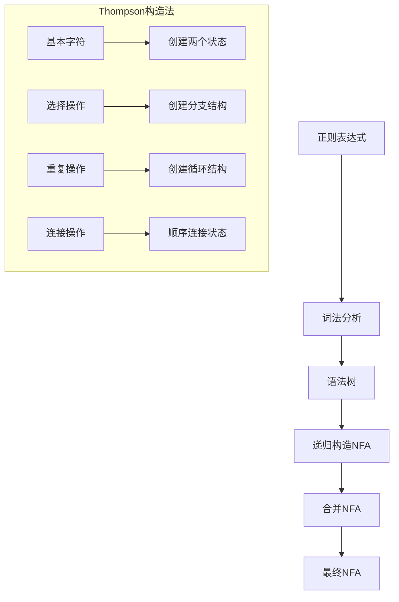
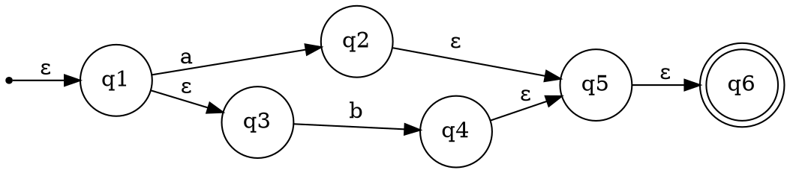
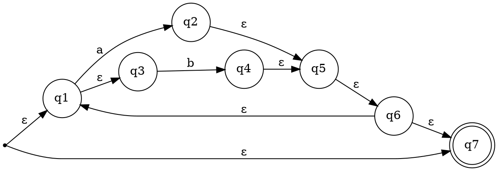
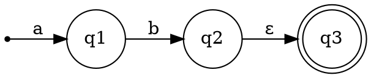

# 第二步：NFA构造

## 页面功能特色

在NFA构造步骤中，我们的平台提供了独特的可视化学习体验：

- **实时NFA可视化**：输入正则表达式后，系统会立即生成对应的NFA状态图，让您直观地看到正则表达式如何转换为有限自动机
- **交互式状态图**：可以点击状态节点查看详细信息，拖动节点调整布局
- **逐步构造过程**：展示从正则表达式到NFA的完整构造过程，帮助理解算法原理
- **错误提示机制**：当输入有误时，系统会给出详细的错误提示和修正建议

相比其他编译原理学习平台，我们的NFA构造工具更加直观和交互式，让抽象的理论概念变得具体可见。

## 输入限制

在NFA构造步骤中，您需要输入一个有效的正则表达式，系统支持以下操作符：

- **基本字符**：字母、数字、特殊字符
- **连接操作**：直接连接（如 `ab`）
- **选择操作**：`|` 符号（如 `a|b`）
- **重复操作**：
  - `*`：零次或多次重复
  - `+`：一次或多次重复
  - `?`：零次或一次重复
- **分组操作**：`()` 括号进行分组
- **转义字符**：`\` 用于转义特殊字符

**输入示例**：
- `a|b` - 匹配字符a或b
- `(ab)*` - 匹配零个或多个ab序列
- `a+b*` - 匹配一个或多个a，后跟零个或多个b

## 知识背景

### NFA的形式定义

非确定有限自动机（NFA）是一个五元组 M = (Q, Σ, δ, q₀, F)：

- **Q**：有限状态集合
- **Σ**：输入字母表
- **δ**：状态转移函数，δ: Q × (Σ ∪ {ε}) → 2^Q
- **q₀**：初始状态
- **F**：接受状态集合

### 从正则表达式构造NFA的算法

我们使用Thompson构造法，将正则表达式递归地转换为NFA：



### 构造规则

1. **基本字符 a**：
   ```
   q₀ --a--> q₁
   ```

2. **选择操作 a|b**：
   ```
   q₀ --ε--> q₁ --a--> q₂
   q₀ --ε--> q₃ --b--> q₄
   q₂ --ε--> q₅
   q₄ --ε--> q₅
   ```

3. **重复操作 a***：
   ```
   q₀ --ε--> q₁ --a--> q₂ --ε--> q₃
   q₂ --ε--> q₁
   q₀ --ε--> q₃
   ```

## 例题演示

让我们以正则表达式 `(a|b)*ab` 为例，演示NFA的构造过程：

### 步骤1：分析正则表达式结构
- 外层：`(a|b)*` 表示零个或多个a或b
- 内层：`ab` 表示字符a后跟字符b

### 步骤2：构造各部分NFA

**构造 (a|b) 的NFA**：


**构造 (a|b)* 的NFA**：


**构造 ab 的NFA**：


### 步骤3：合并得到最终NFA

最终的NFA将包含多个状态，能够识别所有以ab结尾的字符串。

## 学习建议

1. **理解ε转移**：NFA中的ε转移允许自动机在不消耗输入字符的情况下改变状态，这是NFA与DFA的重要区别

2. **掌握Thompson构造法**：这是将正则表达式转换为NFA的标准算法，理解其递归性质

3. **注意状态数量**：Thompson构造法产生的NFA状态数量可能与正则表达式长度成正比

4. **验证构造结果**：使用简单的测试字符串验证构造的NFA是否正确

5. **观察状态转移**：在可视化界面中，仔细观察状态之间的转移关系，理解NFA的非确定性

## 下一步

完成NFA构造后，您将进入**第三步：子集构造法**，学习如何将NFA转换为等价的DFA。这是编译原理中的核心算法之一，将帮助您理解：

- 子集构造法的基本原理
- 如何消除NFA的非确定性
- DFA与NFA的等价性证明
- 状态最小化的重要性

准备好继续学习了吗？点击"下一步"开始子集构造法的学习！ 