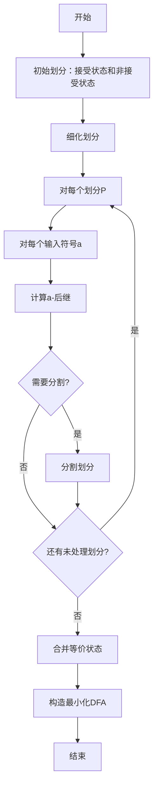
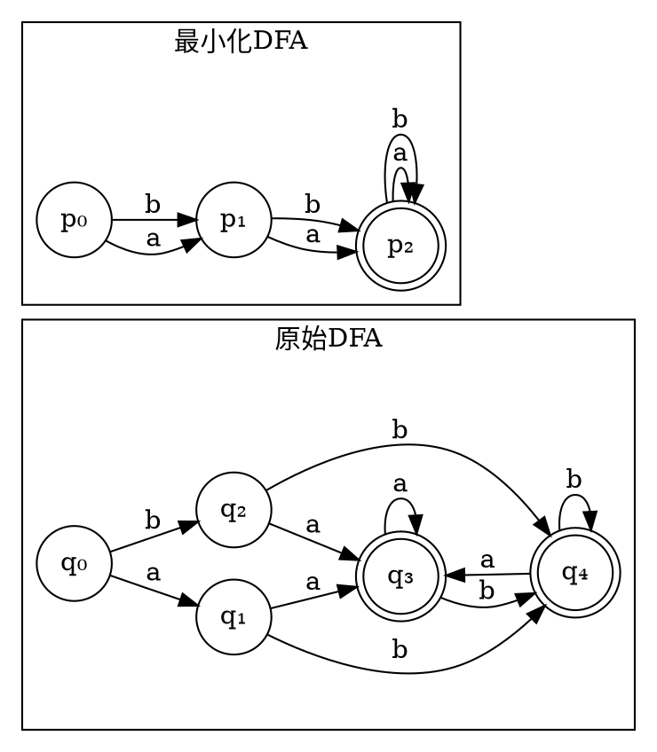
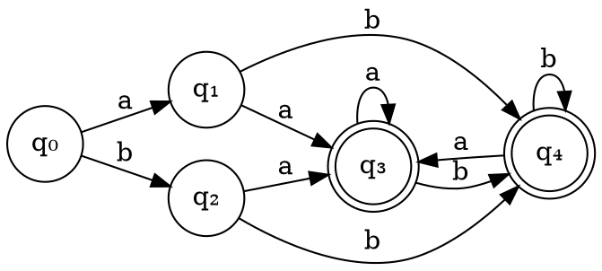
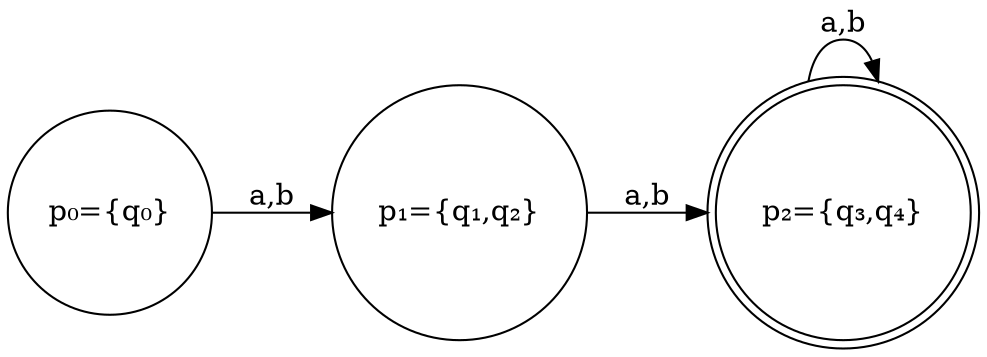

# 第五步：DFA最小化

## 页面功能特色

在DFA最小化步骤中，我们的平台提供了独特的算法可视化体验：

- **逐步最小化过程**：实时展示DFA最小化的每一步操作，让您清楚看到等价状态是如何被识别和合并的
- **等价类可视化**：直观显示状态等价类的划分过程，包括初始划分和细化过程
- **算法步骤追踪**：详细展示Hopcroft算法或Myhill-Nerode定理的应用过程
- **状态合并动画**：通过动画展示等价状态的合并过程，加深理解
- **最小化前后对比**：并排显示原始DFA和最小化DFA，便于比较
- **算法复杂度分析**：显示最小化算法的执行时间和空间复杂度

相比传统的静态教材，我们的DFA最小化工具让复杂的算法变得直观可见，每一步都有清晰的视觉反馈。

## 输入限制

在DFA最小化步骤中，系统会自动处理上一步的DFA，您需要：

- **确认DFA正确性**：确保上一步的DFA构造正确
- **理解最小化目标**：了解最小化的目的是减少状态数量
- **观察算法过程**：关注等价状态的识别和合并过程

**算法输入**：
- 完整的DFA（状态集合、转移函数、初始状态、接受状态）
- 输入字母表

## 知识背景

### DFA最小化的基本原理

DFA最小化的目标是构造一个与原DFA等价但状态数最少的DFA。

**等价DFA**：两个DFA接受相同的语言

### 最小化算法

我们使用Hopcroft算法进行DFA最小化：

### 关键概念

#### 1. 状态等价性

两个状态q₁和q₂等价，当且仅当：
- 对于所有输入字符串w，δ*(q₁, w) ∈ F ⇔ δ*(q₂, w) ∈ F

#### 2. 等价类

等价类是一组相互等价的状态集合。

#### 3. 最小化DFA

最小化DFA的每个状态对应原DFA的一个等价类。

## 例题演示

让我们以DFA为例，演示最小化过程：

### 原始DFA

### 最小化过程

#### 步骤1：初始划分

<strong>初始划分：</strong> 
P₀ = {q₀, q₁, q₂} （非接受状态） 
P₁ = {q₃, q₄} （接受状态）

#### 步骤2：细化划分

**对输入a的转移**：
- q₀ → q₁ ∈ P₀
- q₁ → q₃ ∈ P₁
- q₂ → q₃ ∈ P₁

**对输入b的转移**：
- q₀ → q₂ ∈ P₀
- q₁ → q₄ ∈ P₁
- q₂ → q₄ ∈ P₁

**分割P₀**：
- q₀：转移到P₀和P₀
- q₁：转移到P₁和P₁
- q₂：转移到P₁和P₁

**新划分**：
P₀ = {q₀}
P₁ = {q₁, q₂}
P₂ = {q₃, q₄}

#### 步骤3：继续细化

检查P₁和P₂是否需要进一步分割...

#### 步骤4：最终最小化DFA

### 最小化效果

<strong>最小化效果：</strong> 
原始DFA：5个状态 
最小化DFA：3个状态 
状态减少：40%

## 学习建议

1. **理解等价性**：两个状态等价意味着它们对任何输入字符串的行为完全相同

2. **掌握Hopcroft算法**：这是最常用的DFA最小化算法，理解其分治思想

3. **观察划分过程**：在可视化界面中，仔细观察状态划分的细化过程

4. **验证最小化结果**：确保最小化DFA与原DFA接受相同的语言

5. **分析算法复杂度**：理解最小化算法的时间复杂度为O(n log n)

6. **比较不同算法**：了解Hopcroft算法与其他最小化算法的区别

## 下一步

完成DFA最小化后，您将进入**第六步：最小化DFA可视化**，学习如何：

- 可视化最小化DFA
- 比较原始DFA和最小化DFA
- 验证最小化的正确性
- 理解最小化的实际意义

准备好继续学习了吗？点击"下一步"开始最小化DFA可视化的学习！ 