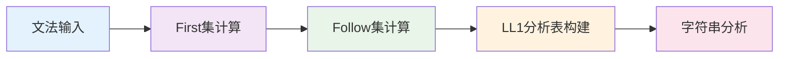

# LL1语法分析模块概述

LL1语法分析是编译原理中自顶向下语法分析的重要方法。通过本模块的学习，您将掌握如何构建LL1分析表，并使用它来分析输入字符串。

## 🎯 模块特色

### 交互式学习体验
与传统的静态教材不同，我们的LL1模块提供：

- **逐步可视化**：每个计算步骤都有详细的可视化展示
- **实时交互**：您可以亲自填写First集、Follow集和分析表
- **即时验证**：系统会实时验证您的填写是否正确
- **智能提示**：提供详细的填写提示和错误分析

### 完整的分析流程
我们涵盖了LL1分析的完整过程：

### 智能AI助手
- **上下文感知**：AI能够理解您当前的学习步骤
- **图表生成**：AI可以生成Mermaid和Graphviz图表来解释概念
- **个性化指导**：根据您的学习进度提供针对性建议

## 📚 学习步骤

### 第一步：文法输入
- **功能**：输入和验证上下文无关文法
- **特色**：严格的文法格式验证，实时错误提示
- **学习目标**：理解CFG文法的结构和规则

### 第二步：First/Follow集计算
- **功能**：计算所有非终结符的First集和Follow集
- **特色**：交互式填写，颜色编码状态，智能验证
- **学习目标**：掌握First集和Follow集的计算方法

### 第三步：LL1分析表构建
- **功能**：基于First/Follow集构建LL1分析表
- **特色**：表格填写，冲突检测，规则应用
- **学习目标**：理解LL1分析表的构建原理

### 第四步：字符串分析
- **功能**：使用LL1分析表分析输入字符串
- **特色**：栈操作可视化，分析过程动画
- **学习目标**：掌握LL1分析的实际应用

## 🔧 技术特色

### 先进的表格技术
- **智能表格**：支持动态行添加和删除
- **状态编码**：不同颜色表示不同的填写状态
- **实时验证**：即时检查填写的正确性
- **进度跟踪**：清晰显示完成进度

### 可视化技术
- **栈操作动画**：可视化展示分析栈的操作
- **状态转换**：清晰显示分析过程中的状态变化
- **错误高亮**：突出显示错误和冲突

### 智能验证系统
- **多级验证**：语法验证、语义验证、逻辑验证
- **详细反馈**：提供具体的错误信息和修正建议
- **学习指导**：根据错误类型提供学习建议

## 💡 学习建议

### 学习顺序
1. **从文法开始**：先理解上下文无关文法的概念
2. **掌握First集**：理解First集的计算方法
3. **学习Follow集**：掌握Follow集的计算规则
4. **构建分析表**：学会如何构建LL1分析表
5. **实践分析**：使用分析表进行字符串分析

### 学习方法
- **理解原理**：不要死记硬背，要理解每个步骤的原理
- **动手实践**：每个步骤都要亲自填写和验证
- **观察规律**：注意First集和Follow集的计算规律
- **及时提问**：遇到问题立即使用AI助手

### 常见误区
- **忽视ε规则**：忘记处理空串的情况
- **混淆First和Follow**：不清楚两者的区别和联系
- **不检查冲突**：没有检查LL1条件是否满足
- **死记硬背**：不理解原理，只记忆步骤

## 🎯 学习目标

通过本模块的学习，您将能够：

1. **理解LL1分析**：掌握LL1分析的基本原理
2. **计算First集**：能够计算任意文法的First集
3. **计算Follow集**：能够计算任意文法的Follow集
4. **构建分析表**：能够构建LL1分析表
5. **分析字符串**：能够使用分析表分析输入字符串
6. **检测冲突**：能够识别和处理LL1冲突

## 📚 下一步

现在您已经了解了LL1模块的整体结构，建议您：

1. **开始第一步**：从文法输入开始学习
2. **充分利用AI助手**：在学习过程中随时获取帮助
3. **实践操作**：亲自动手完成每个步骤
4. **深入理解**：思考每个步骤背后的原理

记住，LL1分析是自顶向下语法分析的基础，掌握好这部分内容将为后续的语法分析学习打下坚实的基础！

准备好开始您的LL1学习之旅了吗？点击"第一步：文法输入"开始吧！ 