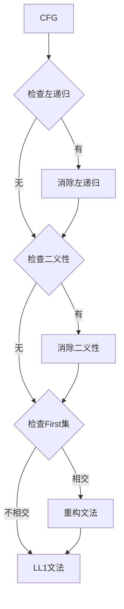
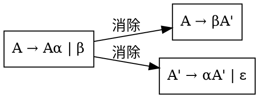
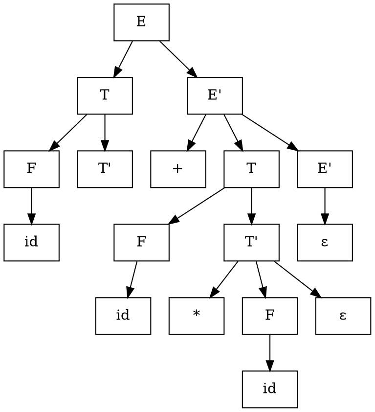

# 第一步：文法输入

## 页面功能特色

在文法输入步骤中，我们的平台提供了智能的文法编辑和验证功能：

- **智能文法编辑器**：提供语法高亮、自动补全、错误提示等编辑功能，让您专注于文法内容而不是格式
- **实时语法检查**：输入过程中实时检查文法格式，及时提示错误和修正建议
- **文法可视化预览**：输入文法后立即显示语法树结构，帮助您直观理解文法定义
- **冲突检测**：自动检测LL1冲突，如左递归、二义性等问题，并提供解决建议
- **模板库**：提供常用文法的模板，如算术表达式、if语句等，便于快速开始
- **导入导出功能**：支持从文件导入文法或导出为多种格式

相比其他编译原理学习平台，我们的文法输入工具更加智能和用户友好，让复杂的文法定义变得简单易用。

## 输入限制

在文法输入步骤中，您需要输入符合LL1要求的上下文无关文法（CFG），系统支持以下格式：

### 文法格式要求

- **产生式格式**：`A → α | β | γ`
- **非终结符**：大写字母或带下标的标识符（如 `S`, `E`, `T`, `F`）
- **终结符**：小写字母、数字、特殊符号（如 `a`, `b`, `+`, `*`, `(`）
- **空串**：使用 `ε` 表示
- **分隔符**：使用 `|` 分隔多个产生式右部

### 输入示例

**算术表达式文法**：
```
E → T | E + T
T → F | T * F
F → (E) | id
```

**if语句文法**：
```
S → if E then S | if E then S else S | id = E
E → E + T | T
T → T * F | F
F → (E) | id
```

## 知识背景

### 上下文无关文法（CFG）

上下文无关文法是一个四元组 G = (V, Σ, P, S)：

- **V**：非终结符集合
- **Σ**：终结符集合
- **P**：产生式集合
- **S**：开始符号

### LL1文法的要求

LL1文法必须满足以下条件：

1. **无左递归**：不能有直接或间接的左递归
2. **无二义性**：对于任何输入，最多只有一个推导
3. **First集不相交**：对于任何非终结符A，其所有产生式的First集不相交



### 左递归消除

**直接左递归**：A → Aα | β

**消除方法**：
- 引入新的非终结符A'
- A → βA'
- A' → αA' | ε



## 例题演示

让我们以算术表达式文法为例，演示文法输入和验证过程：

### 原始文法（有左递归）

```
E → E + T | T
T → T * F | F
F → (E) | id
```

### 文法分析

<div style="background: #fff3cd; padding: 15px; border-radius: 8px; margin: 10px 0; border-left: 4px solid #ffc107;">
<strong>⚠️ 检测到左递归：</strong><br>
- E → E + T （直接左递归）
- T → T * F （直接左递归）
</div>

### 消除左递归后的文法

```
E → TE'
E' → +TE' | ε
T → FT'
T' → *FT' | ε
F → (E) | id
```

### 文法验证

<div style="background: #d4edda; padding: 15px; border-radius: 8px; margin: 10px 0; border-left: 4px solid #28a745;">
<strong>✓ 文法验证通过：</strong><br>
- 无左递归 ✓<br>
- 无二义性 ✓<br>
- First集不相交 ✓
</div>

### 语法树示例

对于输入 `id + id * id`，语法树结构：



## 学习建议

1. **理解LL1要求**：掌握LL1文法的三个基本要求，这是后续分析的基础

2. **练习左递归消除**：熟练掌握直接和间接左递归的消除方法

3. **注意文法设计**：设计文法时要考虑可读性和分析效率的平衡

4. **验证文法正确性**：使用测试用例验证文法的正确性

5. **观察语法树**：理解文法如何定义语言的结构

6. **避免常见错误**：注意避免二义性、左递归等常见问题

## 下一步

完成文法输入后，您将进入**第二步：First/Follow集计算**，学习如何：

- 计算每个非终结符的First集
- 计算每个非终结符的Follow集
- 理解First/Follow集在LL1分析中的作用
- 为构造LL1分析表做准备

准备好继续学习了吗？点击"下一步"开始First/Follow集计算的学习！ 