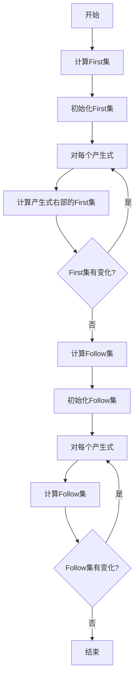
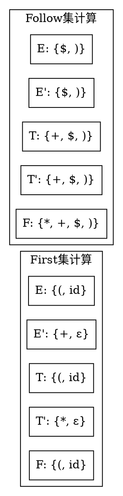

# 第二步：First/Follow集计算

## 页面功能特色

在First/Follow集计算步骤中，我们的平台提供了智能的计算和可视化功能：

- **自动计算引擎**：系统自动计算每个非终结符的First集和Follow集，无需手动计算
- **逐步计算过程**：展示First/Follow集计算的每一步，帮助理解算法原理
- **可视化集合表示**：以图形化方式显示集合内容，直观易懂
- **依赖关系图**：显示非终结符之间的依赖关系，帮助理解计算顺序
- **错误检测**：自动检测计算过程中的错误，如循环依赖等
- **导出功能**：支持将计算结果导出为表格或图片格式

相比传统的手工计算，我们的First/Follow集计算工具让复杂的集合运算变得简单直观。

## 输入限制

在First/Follow集计算步骤中，系统会自动处理上一步输入的文法，您需要：

- **确认文法正确性**：确保文法格式正确且无左递归
- **理解计算原理**：了解First集和Follow集的定义和计算方法
- **观察计算过程**：关注每个集合的计算步骤

## 知识背景

### First集定义

对于非终结符A，First(A)定义为：
- 所有可能从A推导出的字符串的首个终结符的集合
- 如果A可以推导出ε，则ε ∈ First(A)

### Follow集定义

对于非终结符A，Follow(A)定义为：
- 所有可能紧跟在A后面的终结符的集合
- 如果A是某个产生式的最后一个符号，则$ ∈ Follow(A)

### 计算算法



## 例题演示

以文法为例：
```
E → TE'
E' → +TE' | ε
T → FT'
T' → *FT' | ε
F → (E) | id
```

### First集计算

| 非终结符 | First集 |
|----------|---------|
| E | {(, id} |
| E' | {+, ε} |
| T | {(, id} |
| T' | {*, ε} |
| F | {(, id} |

### Follow集计算

| 非终结符 | Follow集 |
|----------|----------|
| E | {$, )} |
| E' | {$, )} |
| T | {+, $, )} |
| T' | {+, $, )} |
| F | {*, +, $, )} |

### 计算过程可视化



## 学习建议

1. **理解集合定义**：掌握First集和Follow集的数学定义
2. **掌握计算算法**：理解迭代计算的过程
3. **注意计算顺序**：Follow集的计算依赖于First集
4. **验证计算结果**：使用测试用例验证计算的正确性

## 下一步

完成First/Follow集计算后，您将进入**第三步：LL1分析表构造**，学习如何：
- 构造LL1分析表
- 理解表项的含义
- 处理冲突情况

准备好继续学习了吗？ 